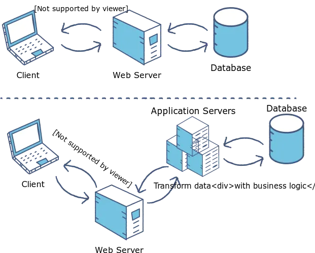
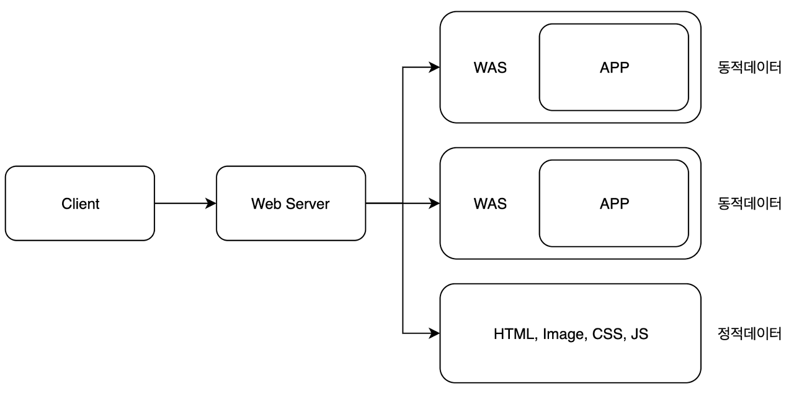

#### 날짜: 2024-04-03

 

### 🌤️ 스크럼

- 학습 목표 1 : 웹 작동방식 이해하기

 

### ⚡️ 새로 배운 내용

#### 💡 용어 정의

- `웹 페이지`  
  인터넷에서 개별적으로 접근할 수 있는 단일 HTML 문서  
   ex. Amazon의 특정 상품 페이지 (ex. apple 상품 페이지)
- `웹 사이트`  
  서로 관련된 웹 페이지들의 집합
  ex. Wikipedia, Amazon
- `웹 브라우저`  
  인터넷에서 웹 서버로부터 받은 정보(웹 사이트)를 보여주는 컴퓨터의 응용 프로그램
  ex. Chrome, Safari
- `웹 서버`  
  웹 브라우저의 요청에 따라, 인터넷에서 사용자에게 정보를 제공하는 컴퓨터나 소프트웨어
  ex. Apache, Nginx
- 웹 서버, 브라우저, 사이트, 페이지를 도서관에 비유한다면?  
  웹 서버 = 도서관 / 웹 브라우저 = 방문자 / 웹 사이트 = 책장 / 웹 페이지 = 책
- `렌더링 엔진`  
  HTML, CSS, JavaScript의 웹 코드를 시각적인 페이지로 변환하는 소프트웨어  
  ex. Chrome의 Blink, Firefox의 Gecko
- `검색 엔진`  
  웹 페이지를 수집하고, 사용자의 검색어에 따라 가장 관련성이 높은 웹 페이지를 찾아주는 소프트웨어  
  ex. Google, Bing
  - 웹 브라우저가 가장 하고 싶은 일이 보여줄 웹 페이지를 찾는 것이기 때문에, 브라우저는 처음 실행되었을 때 종종 검색 엔진의 홈페이지를 보여준다.

#### [WEB] 웹 서버

한 개 이상의 웹 사이트를 호스팅하는 컴퓨터 또는 소프트웨어

- 클라이언트(웹 브라우저)로부터 HTTP 요청을 받는다.

- 요청에 따라

  - 정적인 컨텐츠 제공  
    HTML, CSS, JavaScript, 이미지, 동영상 등의 리소스(웹 페이지)를 제공한다.
  - 동적인 컨텐츠 제공
    웹 애플리케이션 서버에 요청을 전달하고, WAS로부터 받은 결과를 클라이언트에 전달한다.

- 예시  
  `크롬`으로부터 https://youtube.com 이라는 주소로 요청이 오면, 웹 서버는 `youtube` 라는 웹 사이트의 HTML, CSS, JavaScript, 이미지, 동영상 등의 리소스를 제공한다.

#### [WEB] 웹 어플리케이션 서버 (WAS)

다양한 서버 내 알고리즘, 데이터베이스와의 연결, 비즈니스 로직 처리 등 클라이언트 요청에 따라 동적인 컨텐츠를 제공하는 서버

- 웹 서버와 데이터베이스 서버 사이에서 중개자 역할을 한다.
- 웹 서버로부터 동적인 컨텐츠 제공을 위한 요청을 받아, 데이터베이스에서 데이터를 가져와서 웹 서버에 전달한다.
  - 여러 개의 트랜잭션 관리 등 데이터베이스와의 연결을 관리한다.

#### 💡 웹 서버와 웹 애플리케이션 서버의 차이점

- 정적 페이지 (static pages)  
  image, html, css, js 파일과 같이 컴퓨터에 저장되어 있는 파일들
  - 항상 동일한 페이지를 반환한다.
  - **웹 서버가 처리한다.**
- 동적 페이지 (dynamic pages)  
  사용자의 요청에 따라 동적으로 데이터베이스에서 정보를 가져와서 보여주는 페이지
  - **웹 애플리케이션 서버가 처리한다.**

#### ❓ WAS가 웹 서버의 모든 기능을 수행하면 되는 것 아닌가? 웹 서버를 사용하는 이유는?

- 기능을 분리하여 서버 부하를 방지한다.  
  WAS는 DB 조회, 다양한 로직을 수행하느라 바쁘기 때문에, 정적인 파일을 처리하는 웹 서버에게 맡기면 빠르게 처리할 수 있다.

- 물리적으로 분리하여 보안을 강화시킨다.
  웹 서버와 WAS를 분리하면, 웹 서버는 외부와의 통신만 담당하고, WAS는 내부 로직을 처리하므로, 보안을 강화할 수 있다.

- 여러 대의 WAS를 연결해 로드 밸런싱 용도로 사용할 수 있다.  
  Fail over, Fail back 처리에 유용하다.

  > Fail over: 서버가 다운되었을 때, 다른 서버로 자동으로 전환하는 것  
  > Fail back: 서버가 복구되었을 때, 다시 원래 서버로 전환하는 것

  대용량 웹 애플리케이션의 경우, 웹 서버와 WAS를 분리하여 오류가 발생한 서버를 제외하고 나머지 서버로 요청을 전달하는 로드 밸런싱을 사용하여 무중단 운영을 가능하게 한다.

- 여러 언어의 웹 애플리케이션 서비스가 가능하다.  
  웹 서버는 정적인 파일을 처리하는 역할이므로, 어떤 언어로 만든 웹 애플리케이션도 처리할 수 있다.

 

### ~~🔥 오늘의 도전 과제와 해결 방법~~

 

### 🤔 오늘의 회고

- 스크럼 중 완료한 작업: `Web server, WAS, 웹 브라우저` 등 개념 정리
- 비슷한 용어들이 많아서 헷갈렸던 개념들인데, 오늘 서로 간의 차이점을 확실히 알게 되어서 좋았다.  
  웹 서버와 WAS의 역할을 이해하고, 웹 브라우저가 어떤 역할을 하는지도 알게 되었다.
- 웹 서버와 웹 애플리케이션 서버의 차이점은 기술 면접 단골 질문이라고 하니, 잘 기억하고 있어야겠다.

 

### 참고 자료 및 링크

- [MDN web docs - 웹 작동방식](https://developer.mozilla.org/ko/docs/Learn/Common_questions/Web_mechanics/Pages_sites_servers_and_search_engines)
- [웹 서버와 WAS의 차이점](https://binux.tistory.com/32)
