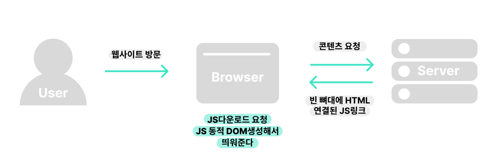
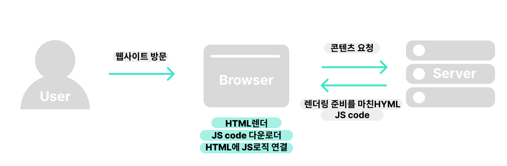

#### 날짜: 2024-04-04

 

### 🌤️ 스크럼

- 학습 목표 1 : CSR, SSR, SSG 이해하기

 

### ⚡️ 새로 배운 내용

#### [WEB] CSR, SSR, SSG

> 💡 **SPA와 MPA**
>
> - Single Page Application
>   | | 분석 | 단어 | 내용 |
>   | --- | --------- | ----------------------- | ------------------------------------------------------------------------------------- |
>   | 1 | 일반 명사 | Single | 하나의 |
>   | | | Page | 페이지 |
>   | | | Application | 응용 프로그램 |
>   | | | Single Page Application | 하나의 페이지인 응용 프로그램 |
>   | 2 | 고유 명사 | Single Page Application | 단일 페이지로 이루어져, 페이지 로딩 없이 필요한 부분만 동적으로 업데이트하는 프로그램 |
>   | 3 | 사용 이유 | Single Page Application | 필요한 데이터만 재렌더링하기 때문에 화면 전환 속도가 빠름 |
> - Multi Page Application
>   | | 분석 | 단어 | 내용 |
>   | --- | --------- | ---------------------- | ---------------------------------------------------------------------- |
>   | 1 | 일반 명사 | Multi | 다수의 |
>   | | | Page | 페이지 |
>   | | | Application | 응용 프로그램 |
>   | | | Multi Page Application | 다수의 페이지인 응용 프로그램 |
>   | 2 | 고유 명사 | Multi Page Application | 사용자의 요청에 따라 새로운 페이지로 이동하며 내용을 로드하는 프로그램 |
>   | 3 | 사용 이유 | Multi Page Application | 복잡한 데이터나 많은 데이터를 다루는 웹 사이트에 적합 |

일반적으로 `SPA`에서는 `CSR`을, `MPA`에서는 `SSR`을 렌더링 방식으로 사용하게 된다.

 

- **CSR**

  Client Side Rendering

  

  |     | 분석               | 단어                  | 내용                                                                                                 |
  | --- | ------------------ | --------------------- | ---------------------------------------------------------------------------------------------------- |
  | 1   | 일반 명사          | Client                | 의뢰인, 고객                                                                                         |
  |     |                    | Side                  | 측면, 방향                                                                                           |
  |     |                    | Rendering             | 무엇인가를 그려내거나 지금과는 다른 어떤 상태로 만드는 과정                                          |
  |     |                    | Client Side Rendering | 고객 측면에서 무엇인가를 그려내거나 지금과는 다른 어떤 상태로 만드는 과정                            |
  | 2   | 고유 명사          | Client Side Rendering | 사용자의 브라우저 측에서 웹 페이지의 내용과 구조를 동적으로 생성하고 업데이트하는 과정               |
  | 3   | 사용 이유          | Client Side Rendering | 사용자 경험 향상, 서버 부하 감소                                                                     |
  | 4   | 사용 방법          | Client Side Rendering | Javascript와 프레임워크(ex. React)를 사용하여 브라우저에서 HTML을 동적으로 생성 및 조작              |
  | 5   | 다른 기술과의 비교 | Client Side Rendering | - 최초에 한 번 서버에서 기본 HTML, CSS 및 모든 필수 스크립트를 로드하기 때문에 초기 로드 시간이 느림 |

  - 서버 요청 없이 클라이언트에서 라우팅하기 때문에 후속 페이지 로드 시간은 훨씬 빠름
  - 브라우저가 js 코드를 실행시키기 전에 검색 엔진 크롤러는 텅빈 html 파일을 읽기 때문에 SEO(검색 엔진 최적화)에 취약 |
  - ex. React, Angular, Vue

- **SSR**

  Server Side Rendering

  

  |     | 분석               | 단어                  | 내용                                                                                                   |
  | --- | ------------------ | --------------------- | ------------------------------------------------------------------------------------------------------ |
  | 1   | 일반 명사          | Server                | 서버, 데이터와 리소스를 관리하고 제공하는 시스템                                                       |
  |     |                    | Side                  | 측면, 방향                                                                                             |
  |     |                    | Rendering             | 무엇인가를 그려내거나 지금과는 다른 어떤 상태로 만드는 과정                                            |
  |     |                    | Server Side Rendering | 서버 측면에서 무엇인가를 그려내거나 지금과는 다른 어떤 상태로 만드는 과정                              |
  | 2   | 고유 명사          | Server Side Rendering | 서버에서 요청을 받았을 때, 필요한 HTML을 생성하여 사용자의 브라우저로 전송하는 과정                    |
  | 3   | 사용 이유          | Server Side Rendering | - SEO 향상, 초기 로드 시간 단축   - 데이터가 자주 달라지는 페이지에 적합                            |
  | 4   | 사용 방법          | Server Side Rendering | 웹 서버에서 프레임워크(ex. Next.js)를 사용하여 페이지의 HTML을 미리 생성하고, 사용자 요청 시 바로 제공 |
  | 5   | 다른 기술과의 비교 | Server Side Rendering | - 페이지 이동 시 매번 html을 요청하기 때문에 서버 부하가 증가할 수 있음                                |

  - 페이지간 전환 및 상호작용이 느림
  - 웹 페이지는 보이지만 js가 로드되지 않아, 아무런 반응이 없는 웹페이지를 마주할 수 있음 |
  - ex. Next.js, Nuxt.js

- **SSG**  
  Static Site Generation

  |                      | 분석               | 단어                   | 내용                                                                                               |
  | -------------------- | ------------------ | ---------------------- | -------------------------------------------------------------------------------------------------- |
  | 1                    | 일반 명사          | Static                 | 고정된                                                                                             |
  |                      |                    | Site                   | 사이트                                                                                             |
  |                      |                    | Generation             | 생성, 생성과정                                                                                     |
  |                      |                    | Static Site Generation | 고정된 사이트를 생성하는 과정                                                                      |
  | 2                    | 고유 명사          | Static Site Generation | 빌드 시점에 모든 페이지를 사전 렌더링하여, 정적 파일로 생성하여 전송하는 과정                      |
  | 3                    | 사용 이유          | Static Site Generation | 데이터 변화가 적은 페이지에 적합                                                                   |
  | 4                    | 사용 방법          | Static Site Generation | 정적 사이트 생성기를 사용하여 사이트를 빌드하고 배포                                               |
  | 5                    | 다른 기술과의 비교 | Static Site Generation | - HTML이 서버에 완성된 형태로 저장되어 있기 때문에 CSR이나 SSR에 비해 초기 페이지 로딩 속도가 빠름 |
  | - 동적인 기능이 없음 |

  - 서버에서 HTML을 보내준다는 차원에서는 SSR과 유사하다.
    - SSR: 요청 시 html 생성하고 응답
    - SSG: 미리 html 생성해두고 요청 시 응답

---

- **Universal Rendering**

초기 렌더링으로는 SSR + 이후 상호작용은 CSR

 

### ~~🔥 오늘의 도전 과제와 해결 방법~~

 

### 🤔 오늘의 회고

- 스크럼 중 완료한 작업: `CSR, SSR, SSG 이해하기`
- 기존에 알고 있던 개념이었지만 딥다이브 시간을 통해서 다시 한 번 정리할 수 있었다.
- 다음에는 각 렌더링 방식을 사용할 때의 장단점을 정리해보면 좋을 것 같다.

 

### ~~참고 자료 및 링크~~
