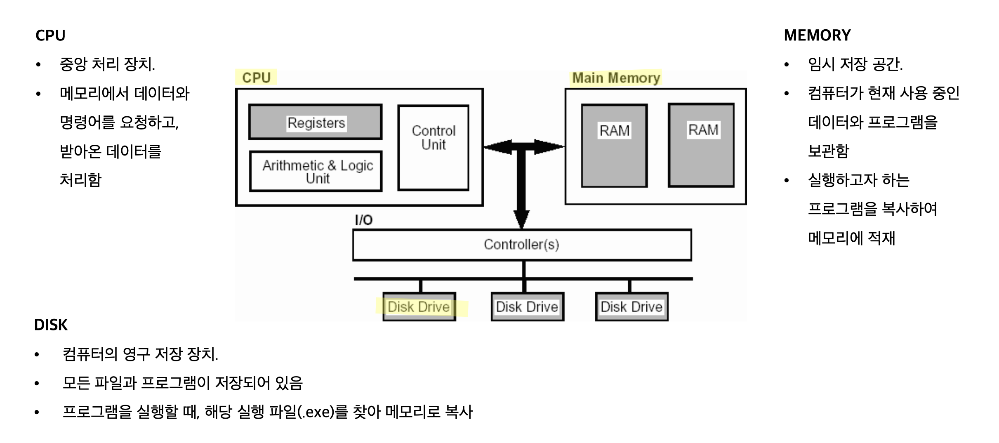
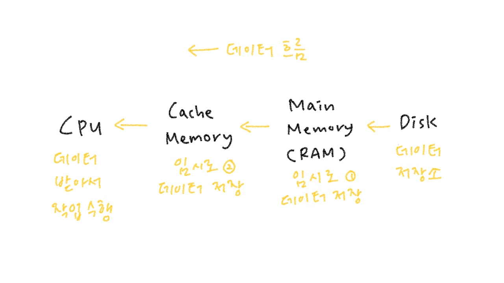
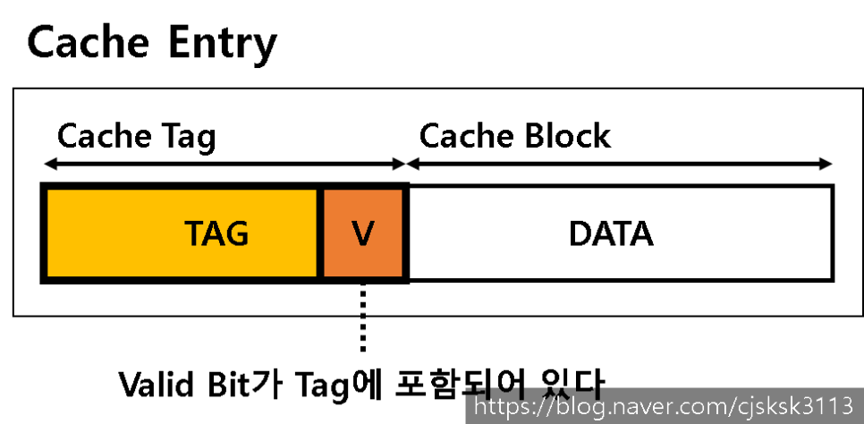

#### 날짜: 2024-04-07

 

### 🌤️ 스크럼

- 학습 목표 1 : 캐시 메모리 이해하기

 

### ⚡️ 새로 배운 내용

> 💡 **캐시**(Cache)란?
>
> - 데이터나 값을 미리 복사해 놓는 임시 장소
> - 🙂 데이터 접근 속도 향상
> - 😞 저장 공간이 작고 비용이 비쌈

> 💡 **프로그램 실행 방식**
>
> `디스크 → 메모리 → CPU`
>
> 

 

---

#### [CS] 캐시 메모리

CPU의 데이터 접근 속도 향상을 위해, 데이터나 값을 미리 저장해두는 임시 저장 장소

- 등장 배경  
  기술의 발전으로 프로세서 속도는 빠르게 증가해온 반면, 메모리의 속도는 이를 따라가지 못했다.  
  → 프로세서가 매번 메인 메모리에 접근해 데이터를 받아오면 시간이 오래 걸린다.  
  → 이를 해결하기 위해 캐시 메모리가 등장

  

- 캐시 메모리의 특징

  - 데이터 접근 속도가 빠름
  - 저장 공간이 작고 비용이 비쌈
  - 데이터 접근 시간을 단축해 시스템의 전반적인 성능을 향상시킴
  - CPU와 메모리 사이에 위치함

- 장점  
  속도가 빠른 장치와 느린 장치의 속도 차이에 따른 병목 형상을 줄인다.

  - ex. CPU 코어와 메모리 사이의 병목
  - ex2. 하드디스크와 웹 페이지 사이의 병목

- **캐시의 종류**

  - CPU 칩에는 캐시 메모리가 2~3개 사용된다.
  - L1 → L2 → L3  
    

- **캐시 메모리 작동 원리**  
  지역성(Locality)을 활용하여 작동한다.

  > 지역성이란? 기억 장치 내의 정보를 균일하게 액세스하는 것이 아니라, 한 순간에 특정 부분을 집중적으로 참조하는 특성

  - **시간 지역성**
    - 최근 접근한 데이터에 대해 다시 접근하는 경향
    - 한 번 참조된 데이터는 가까운 미래에 또 접근할 가능성이 높음
      - ex. `for`, `while` 반복문
        ⇒ 캐시는 반복으로 사용되는 데이터가 많을수록 높은 효율성을 낼 수 있음
  - **공간 지역성**
    - 최근 접근한 데이터의 주변 공간에 다시 접근하는 경향
    - 참조된 데이터 근처에 있는 데이터가 가까운 미래에 또 사용될 가능성이 높음
      - ex. A[0], A[1]

- **캐시 블록**

  캐시 메모리는 **캐시 블록**이라는 데이터 그룹 단위를 가진다.
  각각의 캐시 블록은 데이터를 담고 있으며, **캐시 태그**와 묶여 하나의 **캐시 엔트리**를 구성한다.

  - 캐시 태그: CPU 프로세서가 접근하기 위한 고유 식별값
  - 유효 비트: 해당 캐시 블록에 올바른 데이터가 저장되어 있는지 구분하는 비트

    

- **캐시 구조 및 작동 방식**

  

  - **Direct Mapped Cache**
    - DRAM의 여러 주소가 캐시 메모리의 한 주소에 대응되는 다대일 방식
    - 캐시 메모리의 한 주소에는 하나의 DRAM 주소만 대응
    - 캐시 메모리의 크기가 작아 캐시 미스가 발생할 확률이 높음
    - 검색 속도가 빠르지만 저장이 느림
  - **Fully Associative Cache**
    - 캐시 메모리의 모든 주소가 DRAM의 모든 주소와 대응되는 일대일 방식
    - 캐시 메모리의 한 주소에 여러 DRAM 주소가 대응될 수 있음
    - 검색 속도가 느리지만 저장이 빠름
  - **Set Associative Cache**
    - Direct Mapped Cache와 Fully Associative Cache의 중간 방식
    - 특정 행을 지정하고, 그 행 안의 어떤 열이든 비어있을 때 저장하는 방식
    - Direct Mapped Cache에 비해 검색 속도가 느리지만 저장이 빠름
    - Fully Associative Cache에 비해 저장이 느리지만 검색이 빠름

- **캐시 히트(Cache Hit)와 캐시 미스(Cache Miss)**  
   캐시 메모리에 데이터를 요청했을 때 발생하는 두 가지 상황

  - Hit

    - 요청한 데이터가 캐시에 존재하는 경우
    - `hit latency` : 히트가 발생해 캐싱된 데이터를 가져오는 시간

  - Miss

    - 요청한 데이터가 캐시에 존재하지 않는 경우
    - `miss latency` : 미스가 발생해 상위 캐시나 메인메모리에서 데이터를 가져오는 시간

    - Cache Miss의 3가지 경우

      1.  Cold miss

          - 해당 메모리 주소를 처음 불러서 나는 미스
          - 처음에는 캐시와 메모리가 비어있기 때문에 피할 수 없는 미스이다.

          - 줄이는 방법
            - block size를 늘려 miss penalty를 줄인다.
            - 지역성을 활용해 사용될 block을 예측하여 미리 가져온다.

      2.  Conflict miss

          - 캐시 메모리에 데이터 A, B를 저장해야 하는데, A와 B가 같은 캐시 메모리 주소에 할당되어 있어서 나는 미스
          - direct나 set associate mapping에서 같은 부분을 번갈아가면서 사용

          - 줄이는 방법
            - direct mapping을 set associate로 바꾼다.

      3.  Capacity miss

          - 캐시 메모리의 공간이 부족해서 나는 미스

          - 줄이는 방법
            - 캐시를 크게 한다. (단, 캐시 접근 속도가 느려지고 파워를 많이 먹음)

     

### ~~🔥 오늘의 도전 과제와 해결 방법~~

 

### 🤔 오늘의 회고

- 스크럼 중 완료한 작업: `캐시 메모리 이해하기`
- 캐시 메모리와 관련된 개념을 이해하고, 캐시 메모리의 작동 원리와 종류에 대해 학습했다.

 

### 참고 자료 및 링크

[데이터 처리 방식](https://velog.io/@jimin_lee/%EC%BB%B4%ED%93%A8%ED%84%B0-%EC%95%88%EC%97%90%EC%84%9C-%EB%8D%B0%EC%9D%B4%ED%84%B0%EB%8A%94-%EC%96%B4%EB%96%BB%EA%B2%8C-%EC%B2%98%EB%A6%AC%EB%90%A0%EA%B9%8C)
