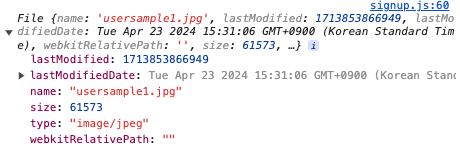
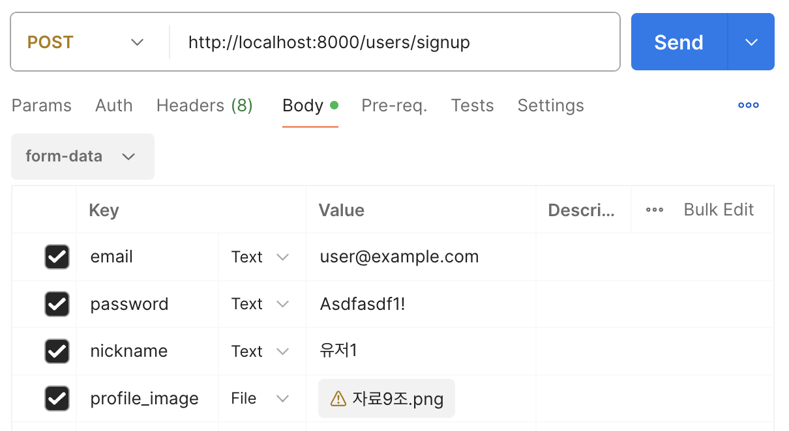

#### 날짜: 2024-05-01

<br/>

### 🌤️ 스크럼

-   학습 목표 1 : 커뮤니티웹 express 서버 구현

<br/>

### ⚡️ 새로 배운 내용

#### 1. Multer

-   파일 업로드를 위해 사용되는 미들웨어
-   `multipart/form-data` 형식의 데이터를 다루기 위해 사용한다.
-   `req.file`로 파일 정보를 확인할 수 있다.

`routes/router.js`

```javascript
// ES6
import multer from "multer";
// CommonJS
const multer = require("multer");

// 파일 업로드를 위한 미들웨어 생성
const upload = multer({ dest: "uploads/" });

//  .single() : 이미지를 req.file에 저장하여 next middleware로 전달
// "image" : form-data의 key 값 (필드명)
app.post("/upload", upload.single("image"), (req, res) => {
    console.log(req.file);
    res.send("파일 업로드 완료");
});
```

<br/>

### 🔥 오늘의 도전 과제와 해결 방법

#### 도전 과제 1: 서버에서 이미지 처리하기

-   상황  
    어제 해결하지 못했던 `서버에서 formData로 받은 이미지를 처리하는 방법`을 해결해야 한다.
-   의도  
    `multer`를 사용하여 이미지를 서버로 전송하고, `req.file`로 이미지 정보를 확인한다.
-   방법  
    클라이언트에서 formData로 데이터를 전송해주었다는 것을 가정한다.  
    **1. formData에 이미지를 담고 요청 header에 `Content-Type`을 지정한다.**

    ```http
    headers: {
        "Content-Type": "multipart/form-data",
        },
    ```

    ↓

    ```javascript
    function onClickSignUpBtn(e) {
        // formData에 담긴 이미지를 서버로 전송
        // 아직 서버 구현 중이라 아래 코드는 임시로 작성한 것
        const formData = new FormData();

        formData.append("email", $emailField.value);
        formData.append("password", $passwordField.value);
        formData.append("nickname", $nicknameField.value);
        formData.append("profile_image", $profileImageUploadField.files[0]);

        fetch("http://localhost:3000/signup", {
            method: "POST",
            headers: {
                "Content-Type": "multipart/form-data",
            },
            body: formData,
        });
    }
    ```

    > `formData.get("profile_image")`를 통해 데이터를 확인할 수 있다.
    > 

    +\) postman으로 보내기
    

    **2. router에서 `multer`를 사용하여 이미지를 받는다.**

    `routes/userRouter.js`

    ```javascript
    import multer from "multer";
    const upload = multer({ dest: "uploads/" });

    router.post("/signup", upload.single("profile_image"), userController.signUp);
    ```

    **3. `req.file`로 이미지 정보를 확인한다.**

    `controllers/userController.js`

    ```javascript
    const signUp = async (req, res) => {
        try {
            const profile_image = req.file;
            const { email, password, nickname } = req.body;
            console.log(profile_image);
            console.log(email, password, nickname);

            const user_id = await User.createUser({
                email,
                password,
                nickname,
                profile_image,
            });

            res.status(200).json(user_id);
        } catch (error) {
            res.status(409).json({ message: error.message });
        }
    };
    ```

-   결과

    -   로그 결과

    ```bash
    // console.log(profile_image)
    {
    fieldname: 'profile_image',
    originalname: '자료9조.png',
    encoding: '7bit',
    mimetype: 'image/png',
    destination: 'uploads/',
    filename: 'cc695003a5b175de683f8eae5bf00202',
    path: 'uploads/cc695003a5b175de683f8eae5bf00202',
    size: 99145
    }

    // console.log(email, password, nickname)
    user@example.com Asdfasdf1! 유저1
    ```

    -   `users.json`

    ```json
    [
        {
            "user_id": 4,
            "email": "user@example.com",
            "password": "Asdfasdf1!",
            "nickname": "유저1",
            "profile_image": {
                "fieldname": "profile_image",
                "originalname": "자료9조.png",
                "encoding": "7bit",
                "mimetype": "image/png",
                "destination": "uploads/",
                "filename": "cc695003a5b175de683f8eae5bf00202",
                "path": "uploads/cc695003a5b175de683f8eae5bf00202",
                "size": 99145
            },
            "created_at": "2024-05-01 23:34"
        }
    ]
    ```

<br/>

### 오늘의 회고

-   스크럼 중 완료한 작업: `커뮤니티웹 express 서버 구현` ing ...
-   어제 문제를 해결하지 못한 채로 업무를 마무리했어서 이후에 팀원들과 주변의 백엔드 개발자에게 이미지 처리 방식에 대해 물어보았다. 모두 클라이언트에서는 `formData`로 처리하고 서버에서는 `multer`로 그 이미지를 받아야 한다고 했다. 그래서 오늘 `multer`를 사용하여 이미지를 서버로 전송하고, `req.file`로 이미지 정보를 확인하는 방법을 적용했다.
-   문제 해결 방법을 조사할 때 **생소한 개념이라도 많은 사람들이 사용 중이라면 일단 시도해보는 것** 이 좋은 것 같다. 어제 `multer`를 알게 된 후 바로 시도해봤으면 이 문제를 해결하는 데에 오랜 시간이 걸리지 않았을 것 같다.

<br/>

### 참고 자료 및 링크

-   [express + multer](https://gngsn.tistory.com/37)
