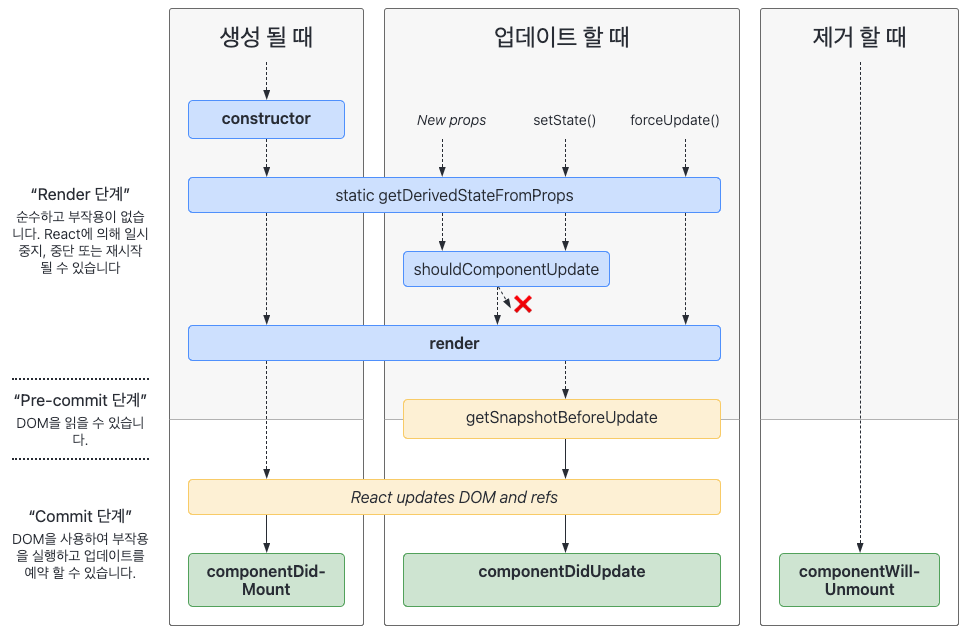

#### 날짜: 2024-05-03

<br/>

### 🌤️ 스크럼

-   학습 목표 1 : 커뮤니티웹 express 서버 구현 완료
-   학습 목표 2 : 커뮤니티웹 서버와 클라이언트 연결
-   학습 목표 3 : "클래스형 컴포넌트의 생명주기" 딥다이브하기

<br/>

### ⚡️ 새로 배운 내용

#### 1. 서버에서 commonJS vs ESM

-   commonJS : require, module.exports
-   ESM : import, export
-   **서버에서는 ESM보다 CommonJS를 사용하는 것이 더 좋다**
    -   npm에서 제공하는 모든 라이브러리가 ESM과 완벽호환 된다고 보장 할 수 없다.
        -   npm 제공 라이브러리는 commonJS를 시발점으로 개발되었기 때문
    -   서버는 트리쉐이킹에서 FE 코드대비 상대적으로 더 자유롭다. 또한 경우에 따라서 모듈을 전역 스코프가 아닌 곳에서 호출할 수 있다. (런타임 도중 호출 할 수 있기 때문에 본질적으로 더 동적이다.)
        -   `트리쉐이킹` : 사용하지 않는 코드를 제거하는 것
    -   FE의 경우 정적인 성향이 강하기 때문에 ESM과 궁합이 잘 맞고, 번들사이즈가 크다면 페이지 로드 타임이 길어질 수 밖에 없기 때문에 트리쉐이킹이 필수적이다.
    -   jeff\) ESM이 계속해서 영향력이 커진다고는 하지만 본질적으로 **commonJS가 가진 동적 모듈 로드, npm 에서의 영향력 등을 바이패스하기엔 한참 부족** 하다고 생각됩니다. (JDK가 23까지 나와도 한국은 아직 8버전 쓰는 것처럼 CommonJS의 영향력이 사라지기엔 아직 10년은 이르다 애송이 하하)
    -   [notion link](https://www.notion.so/goorm/3-3a385964598648549e41c0e9ff6b769a?pvs=4#105b0e304f1c48b3b6867ab25d01caa3)

#### 2. 클래스형 컴포넌트의 생명주기



1. Mount  
   컴포넌트 객체가 최초로 생성되어 DOM에 삽입될 때 한 번 실행된다. - constructor - static getDerivedStateFromProps - render - componentDidMount
2. Update  
   props, state가 변경될 때마다 수행되며, 변경사항을 화면에 표시한다. - static getDerivedStateFromProps - shouldComponentUpdate - render - getSnapshotBeforeUpdate - componentDidUpdate
3. Unmount  
   컴포넌트가 DOM 상에서 제거될 때 한 번 호출된다. - componentWillUnmount

-   [notion link](https://www.notion.so/goorm/4-class-LifeCycle-bb1f1ee7d49a495484fb2ae7829c624a?pvs=4)

<br/>

### 🔥 오늘의 도전 과제와 해결 방법

#### 도전 과제 1: ESM 서버를 CommonJS로 변경하기

-   상황  
    서버를 처음 개발하면서 ESM으로 구현했는데, 서버 측 코드는 ESM보다 CJS가 더 적합하다는 것을 알게 되었다. 그래서 CJS로 변경해보기로 했다.
-   방법
    1. `package.json` 파일에 `"type": "module"`을 삭제한다.
    2. `import` 구문을 `require`로 변경한다.
    3. `export` 구문을 `module.exports`로 변경한다.

#### 도전 과제 2: 바닐라JS에서 공통 컴포넌트 만들기

-   상황  
    모든 페이지에서 공통으로 사용되는 컴포넌트인 헤더를 따로 분리하여 관리하고자 했다.
-   의도  
    처음에 header.html 파일을 생성해서 각 html 파일에서 사용하는 방법을 알아보았지만, js 파일에서 동적으로 header 태그 안에 html 요소를 넣어주는 방법을 사용하기로 했다.
-   방법

    <details>
    <summary>코드</summary>
    <div markdown="1">

    ```javascript
    document.addEventListener("DOMContentLoaded", function () {
        const $headerContainer = document.querySelector(".header-container");

        // TODO: 로그인 상태 확인
        const isLoggedIn = true;

        const headerElement = createHeader(isLoggedIn);
        $headerContainer.appendChild(headerElement);
    });

    function createHeader(isLoggedIn) {
        const header = document.createElement("div");
        header.classList.add("block");

        if (!isLoggedIn) {
            header.innerHTML = `
        <span class="header-title" onclick="location.reload()">
            아무 말 대잔치
        </span>
        `;
        } else {
            header.innerHTML = `
        <button class="back" onclick="window.history.back()">
            
        </button>
        <span class="header-title" onclick="location.href='/'">
            아무 말 대잔치
        </span>
        
        <div class="modal-menu" id="header-modal">
            <div class="modal-content">
                <a class="modal-item" href="/update-info">
                    회원정보 수정
                </a>
                <a class="modal-item"
                    href="/update-pwd"
                >
                    비밀번호 수정
                </a>
                <a class="modal-item logoutbtn"
                    href="/signin"
                >
                    로그아웃
                </a>
            </div>
        </div>
        `;
        }
        return header;
    }
    ```

    </div>
    </details>

#### 도전 과제 3: 공통 함수 만들고 import 해서 사용하기

-   상황  
    클라이언트 측 코드에서 서버에 요청을 보내는 코드(헤더 및 옵션 등)가 반복되어 사용될 예정이니, 공통 함수로 만들어서 사용하고자 했다.
-   의도  
    `fetch.js` 파일을 생성하여 공통 함수를 만들고, 다른 파일에서 import하여 사용한다.
-   방법

    1. 공통 함수를 만든다.
       `fetch.js`

        ```javascript
        export async function fetchRaw(url, method, data) {
            const requestUrl = BASE_URL + url;

            return fetch(requestUrl, {
                method: method,
                headers: {
                    "Content-Type": "application/json",
                },
                body: JSON.stringify(data),
                credentials: "include",
            }).then((res) => {
                if (res.ok) {
                    return res.json();
                } else {
                    throw new Error("API Error");
                }
            });
        }
        ```

    2. 다른 파일에서 import하여 사용하기 위해 html 파일의 script 태그에 `type="module"`을 추가한다.
       `signin.html`

        ```html
        <script type="module" src="../../js/user/signin.js"></script>
        ```

    3. `fetch.js`를 import하여 사용한다.
       `signin.js`

        ```javascript
        import { fetchRaw } from "../fetch.js";
        ```

<br/>

### 오늘의 회고

-   스크럼 중 완료한 작업: `커뮤니티웹 express 서버 구현 완료`, `클래스형 컴포넌트의 생명주기 딥다이브하기`
    -   `커뮤니티웹 서버와 클라이언트 연결` ing..
-   드디어 서버 구현을 완료했다! 클라이언트와 연결하면서 생각보다 보완해야 할 부분이 발견되었지만 클라이언트 코드와 함께 계속 보완해나갈 예정이다.
-   **fetch 함수를 분리하여 사용하게 되면서 코드 중복을 줄일 수 있었다. 아이디어는 팀원의 코드를 보고 얻었지만, 공통 함수를 만들어서 사용하는 것이 효율적이라는 것을 느꼈다.**
-   딥다이브를 통해 생소한 개념인 클래스형 컴포넌트에 대해 공부했다. 리액트의 컴포넌트 개념에 대해 더 깊이 이해할 수 있었다.
-   예정보다 과제 진행 기간이 너무 길어지고 있다. 수업이 끝나고 저녁시간을 잘 활용해야 한다!!

<br/>

### 참고 자료 및 링크

-   [클래스형 컴포넌트의 생명주기](https://www.w3schools.com/react/react_class.asp)
