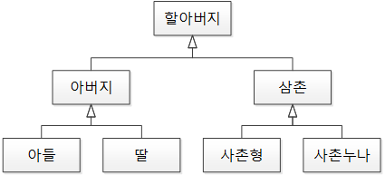
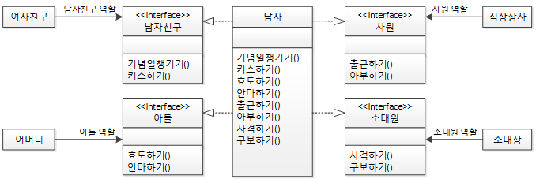

#### 날짜: 2024-05-19

<br/>

### 🌤️ 스크럼

- 학습 목표 1 : OOP와 SOLID 공부하기

<br/>

### ⚡️ 새로 배운 내용

#### 1. [JAVA] OOP (Object Oriented Programming)

제품의 부품에 해당하는 객체를 먼저 만들고, 이 객체들을 조립해서 전체 프로그램을 완성하는 방법론

> **객체란?**
> 물리적으로 존재하거나 추상적으로 생각할 수 있는 것 중에서 자신의 속성을 가지고 있고 다른 것과 식별 가능한 것

- 객체 지향 프로그래밍의 특징

  - **캡슐화 (Encalsulation)**  
    객체의 필드, 메소드를 하나로 묶고, 실제 구현 내용을 감추는 것

    - 외부 객체는 객체의 내부 구조를 알지 못하며 객체가 노출한 필드와 메소드만 이용할 수 있다.  
      → 외부의 잘못된 사용으로 객체가 손상되는 것을 방지할 수 있다.
    - 캡슐화된 멤버를 노출시킬 것인지, 숨길 것인지는 `접근제한자`로 제어한다.

  - **추상화 (Abstraction)**
    객체들의 공통된 특성을 추출해서 정의하는 것

    - 객체의 공통된 특성을 추출해서 `추상 클래스`나 `인터페이스`로 선언한다.

  - **상속 (Inheritance)**  
    상위 객체가 가지고 있는 특성과 행위를 하위 객체가 물려받는 것

    - 코드의 재사용성을 높이고, 코드 중복을 줄일 수 있다.
    - 하위 객체를 쉽고 빨리 설계할 수 있다.
    - 상속 관계에서는 `부모 클래스`와 `자식 클래스`가 존재한다.

    > **추상화와 상속의 차이**
    >
    > - 추상화  
    >   객체들의 공통적인 특성을 추출해서 정의하는 것
    >   - 구현 방법: 추상클래스나 인터페이스를 통해 구현된다.
    >   - 목적: 중요한 기능만 노출하고, 세부 구현을 숨긴다.
    >   <details>
    >   <summary>예시 코드</summary>
    >     
    >     ```java
    >     public abstract class Shape {
    >         // 추상 메소드: 서브 클래스가 구현해야 함
    >         public abstract double area();
    >     }
    >     
    >     public class Circle extends Shape {
    >         private double radius;
    >    
    >         @Override
    >         public double area() {
    >             return Math.PI * radius * radius;
    >         }
    >     }
    >     ```
    >   </details>
    > - 상속  
    >   이미 존재하는 클래스를 기반으로 새로운 클래스를 만드는 것
    >   - 클래스 간의 계층구조를 만든다.
    >   - 목적: 공통된 기능의 재사용과 확장을 위해 사용된다.

  - **다형성 (Polymorphism)**  
    하나의 타입에 여러 객체를 대입함으로써 다양한 기능을 수행할 수 있는 것

    - 하나의 메소드가 다양한 방식으로 동작하는 것
    - 자바는 다형성을 위해 부모 클래스 또는 인터페이스의 형변환을 허용한다.
    - `오버로딩`, `오버라이딩`을 통해 구현된다.
      <details>
      <summary>예시 코드</summary>
      자동차 설계에서 타이어 인터페이스 타입을 적용했다면, 이 인터페이스를 구현한 실제 타이어들은 어떤 것이든 상관없이 장착(대입)이 가능하다.

      ```java
      interface Tire {
        void roll();
      }

      class KumhoTire implements Tire {
        @Override
        public void roll() {
          System.out.println("금호 타이어가 굴러갑니다.");
        }
      }

      class HankookTire implements Tire {
        @Override
        public void roll() {
          System.out.println("한국 타이어가 굴러갑니다.");
        }
      }

      class Car {
        Tire tire;

        void setTire(Tire tire) {
          this.tire = tire;
        }

        void run() {
          tire.roll();
        }
      }

      public class Main {
        public static void main(String[] args) {
          Car car = new Car();

          Tire tire1 = new KumhoTire();
          Tire tire2 = new HankookTire();

          // 자동차 객체에 다양한 타이어를 장착할 수 있다.
          car.setTire(tire1);
          car.run(); // 금호 타이어가 굴러갑니다.

          car.setTire(tire2);
          car.run(); // 한국 타이어가 굴러갑니다.
        }
      }
      ```

      </details>

#### 2. [JAVA] SOLID 원칙

객체 지향 설계의 5대 원칙

1. **SRP (Single Responsibility Principle)**  
   단일 책임 원칙  
   클래스는 단 하나의 책임을 가져야 한다.

   - `캡슐화`와 `추상화`로 구현할 수 있다.
   - 변경이 있을 때 파급 효과가 적다.
   - 높은 응집도와 낮은 결합도를 유지할 수 있다.

2. **OCP (Open-Closed Principle)**  
   개방-폐쇄 원칙  
   확장에는 열려 있고, 수정에는 닫혀 있어야 한다.

   - `추상화`와 `다형성`으로 구현할 수 있다.
   - 기존 코드를 변경하지 않고 새로운 기능을 추가할 수 있다.

3. **LSP (Liskov Substitution Principle)**  
   리스코프 치환 원칙  
   상위 타입의 객체를 하위 타입의 객체로 대체해도 프로그램의 의미는 변하지 않아야 한다.

   - `상속`과 `다형성`으로 구현할 수 있다.
   - 상속 관계에서는 부모 클래스의 메소드를 자식 클래스에서 오버라이딩할 때, 부모 클래스의 메소드와 동일한 기능을 수행해야 한다.
   <details>
   <summary>예시</summary>

   - LSP를 잘 구현한 사례: 박쥐는 포유류의 역할을 할 수 있다.

     

   - LSP 위반 사례: 딸은 아버지의 역할을 할 수 없다.  
     

     </details>

4. **ISP (Interface Segregation Principle)**  
   인터페이스 분리 원칙  
   클라이언트가 자신이 사용하지 않는 메소드에 의존하지 않아야 한다.

   - `추상화`와 `캡슐화`로 구현할 수 있다.
   - 자신이 사용하지 않는 인터페이스는 구현하지 않는다.

   > SRP가 클래스의 단일 책임을 강조하는 것이라면, ISP는 인터페이스의 단일 책임을 강조한다.

   <details>
    <summary>예시</summary>

   
   너무 많은 클래스 구현을 불러온다.  
    ↓
   
   다양한 역할을 인터페이스로 만들고 남자라는 클래스는 그 인터페이스를 구현한 클래스로 만든다.

   </details>

5. **DIP (Dependency Inversion Principle)**  
   의존 역전 원칙  
   고수준 모듈은 저수준 모듈에 의존하면 안된다. 둘 다 추상화에 의존해야 한다.

   - `추상화`와 `캡슐화`로 구현할 수 있다.
   - `DI(의존성 주입, Dependency Injection)`를 통해 구현할 수 있다.
   - 상위 클래스일수록, 인터페이스나 추상클래스일수록 변하지 않을 가능성이 크다.  
     하위 클래스나 구현 클래스에 의존하지 말고, 추상체에 의존하도록 한다.
   - 추상체에 의존하고 있어 독립적으로 테스트하기 편하다.

<br/>

### ~~🔥 오늘의 도전 과제와 해결 방법~~

<br/>

### 🤔 오늘의 회고

- 스크럼 중 완료한 작업: `OOP와 SOLID 원칙 공부`
- OOP와 SOLID 원칙에 대해 공부하면서, 객체 지향 프로그래밍의 개념과 원칙을 다시 한 번 정리할 수 있었다.
- 자바 개발을 위해서 알아야 할 개념들과 지켜야 할 원칙들을 알게 되어서 좋았다.
- 인터페이스와 추상클래스에 대한 개념이 부족한 상태라, 이 부분에 대해 더 공부해야겠다.

<br/>

### 참고 자료 및 링크

- [이것이 자바다] 6.1 객체 지향 프로그래밍
- [다형성 완벽 이해](https://inpa.tistory.com/entry/OOP-JAVA%EC%9D%98-%EB%8B%A4%ED%98%95%EC%84%B1Polymorphism-%EC%99%84%EB%B2%BD-%EC%9D%B4%ED%95%B4)
- [SOLID](https://sehun-kim.github.io/sehun/solid/)
