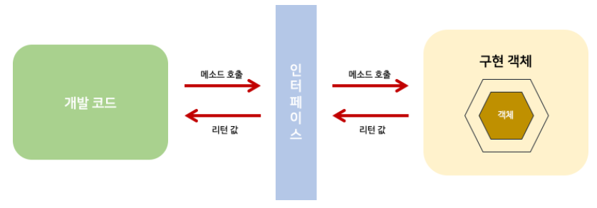

#### 날짜: 2024-05-22

<br/>

### 🌤️ 스크럼

- 학습 목표 1 : 인터페이스 이해하기

<br/>

### ⚡️ 새로 배운 내용

#### [JAVA] 인터페이스

객체의 사용 방법을 정의한 타입



- 개발 코드와 객체가 서로 통신하는 접점 역할을 한다.
- 개발 코드가 인터페이스의 메소드를 호출하면 인터페이스는 객체의 메소드를 호출한다.
- 그렇기 때문에 개발 코드는 객체의 내부 구조를 알 필요가 없고, 인터페이스의 메소드만 알면 된다.

> ❓ 그냥 개발 코드가 직접 객체의 메소드에 호출하면 되잖아?
>
> - 개발 코드가 객체의 메소드를 직접 호출하면 객체를 변경할 때 개발 코드도 수정해야 한다.
> - 인터페이스는 하나의 객체가 아니라 여러 객체들과 사용이 가능하므로, 어떤 객체를 사용하느냐에 따라 실행 내용과 리턴값이 다를 수 있다.
> - **인터페이스를 사용하면 개발 코드를 수정하지 않고 객체를 변경할 수 있으며 실행 내용과 리턴값도 다르게 할 수 있다.**

<br/>

- **인터페이스 선언**

  ```java
  public interface 인터페이스명 {
      public static final 타입 상수명 = 값; // 상수
      public abstract 반환타입 메소드명(매개변수); // 추상 메소드
  }
  ```

  - 상수

    - 인터페이스는 데이터를 저장할 수 없기 때문에 데이터를 저장할 인스턴스 또는 정적 필드를 선언할 수 없다.
    - 대신 상수 필드만 선언할 수 있다.
    - 상수는 모두 ~~(생략되어 있어도)~~ `public static final`의 특성을 갖는다.
    - 상수는 대문자로 작성한다. ex. MAX_VALUE

  - 추상 메소드

    - 인터페이스를 통해 호출된 메소드는 최종적으로 객체에서 실행된다.
    - 그렇기 때문에 인터페이스의 메소드는 실행 블록이 필요 없는 추상 메소드로 선언한다.
    - 모든 메소드는 `public abstract`의 특성을 갖는다.

- **인터페이스 구현과 사용**

  ```java
  public class 클래스명 implements 인터페이스명 {
      // 인터페이스에 선언된 추상 메소드의 실체 메소드 선언
  }

  인터페이스명 객체 = new 클래스명();
  ```

  - `객체` = 구현 객체, `클래스명` = 구현 클래스
  - 인터페이스를 구현한 클래스는 인터페이스의 추상 메소드를 **모두 오버라이딩해야 한다.**
  - 인터페이스의 추상 메소드를 오버라이딩하지 않으면 컴파일 오류가 발생한다.

    <details>
    <summary>코드 예시</summary>

    ```java
    public interface RemoteControl {
        public void turnOn();
        public void turnOff();
    }

    public class Television implements RemoteControl {
        public void turnOn() { // 추상 메소드의 실체 메소드
            System.out.println("TV를 켭니다.");
        }
        public void turnOff() { // 추상 메소드의 실체 메소드
            System.out.println("TV를 끕니다.");
        }
    }

    public class Audio implements RemoteControl {
        public void turnOn() {
            System.out.println("오디오를 켭니다.");
        }
        public void turnOff() {
            System.out.println("오디오를 끕니다.");
        }
    }

    public class RemoteControlExample {
        public static void main(String[] args) {
            RemoteControl rc = null;

            rc = new Television();
            rc.turnOn(); // TV를 켭니다.
            rc.turnOff(); // TV를 끕니다.

            rc = new Audio();
            rc.turnOn(); // 오디오를 켭니다.
            rc.turnOff(); // 오디오를 끕니다.
        }
    }
    ```

    </details>

- **익명 구현 객체**

  - 인터페이스를 구현한 클래스를 따로 선언하지 않고, 필요한 곳에서 바로 객체를 생성하는 방법
  - 일회성의 구현 객체를 만들기 위해 소스 파일을 만들고 클래스를 선언하는 것은 비효율적이다.
  - 클래스의 이름을 생략하고 `new 인터페이스명() { ... }` 형태로 작성한다.

    <details>
    <summary>코드 예시</summary>

    ```java
    public class RemoteControlExample {
        public static void main(String[] args) {
            RemoteControl rc = new RemoteControl() {
                public void turnOn() {
                    System.out.println("TV를 켭니다.");
                }
                public void turnOff() {
                    System.out.println("TV를 끕니다.");
                }
            };

            rc.turnOn(); // TV를 켭니다.
            rc.turnOff(); // TV를 끕니다.
        }
    }
    ```

    </details>

- **다중 인터페이스**

  - 클래스는 여러 인터페이스를 구현할 수 있다.
  - 인터페이스는 다른 인터페이스를 상속받을 수 있다.

  ```java
  public class ImplementClass implements InterfaceA, InterfaceB {
      // InterfaceA, InterfaceB의 추상 메소드를 모두 오버라이딩해야 한다.
  }
  ```

    <details>
    <summary>코드 예시</summary>

  ```java
  public interface RemoteControl {
    public void turnOn();
    public void turnOff();
  }

  public interface Searchable {
    public void search(String url);
  }

  public class SmartTelevision implements RemoteControl, Searchable {
    private int volume;

      public void turnOn() {
          System.out.println("TV를 켭니다.");
      }
      public void turnOff() {
          System.out.println("TV를 끕니다.");
      }
      public void setVolume(int volume) {
          if (volume > RemoteControl.MAX_VOLUME) {
              this.volume = RemoteControl.MAX_VOLUME;
          } else if (volume < RemoteControl.MIN_VOLUME) {
              this.volume = RemoteControl.MIN_VOLUME;
          } else {
              this.volume = volume;
          }
          System.out.println("현재 TV 볼륨: " + this.volume);
      }
      public void search(String url) {
          System.out.println(url + "을 검색합니다.");
      }

  }

  ```

  </details>

- **타입 변환과 다형성**

  - 요즘은 상속보다는 인터페이스를 통해서 다형성을 구현하는 경우가 더 많다.
    > 다형성: 하나의 타입에 대입되는 객체에 따라 실행 결과가 다양한 형태로 나타나는 성질
  - <details>
    <summary>이해 쏙쏙 인터페이스의 다형성 예시</summary>

    A 클래스를 이용해서 프로그램을 개발한다.

    개발 완료 후, 전체 프로그램을 테스트해보니 A 클래스에 문제가 있어 원하는 결과가 나오지 않는다.  
    그래서 B 클래스로 바꾸려고 한다.

    하지만 B 클래스의 메소드는 A 클래스의 메소드와 이름, 매개변수, 리턴값이 다르다.  
    어쩔 수 없이 A 클래스의 메소드가 호출되는 부분을 B 클래스의 메소드로 바꿔야 한다.

    만약, A 클래스와 B 클래스의 메소드 선언부(리턴값, 매개변수)가 동일하다면?

    - A 클래스의 객체를 B 클래스의 객체로 바꾸기만 하면 된다.
    - 이렇게 하면 A 클래스의 객체를 사용하는 코드를 수정하지 않아도 된다.

    ```java
    // I i = new A(); -> B로 변경
    I i = new B();

    i.method1();
    i.method2();
    ```

    </details>

<br/>

### ~~🔥 오늘의 도전 과제와 해결 방법~~

<br/>

### 🤔 오늘의 회고

- 스크럼 중 완료한 작업: `인터페이스 이해하기`
- 수업을 듣고도 이해가 잘 되지 않던 인터페이스 ... 이제야 이해가 되는 것 같다.
- 인터페이스를 사용하면 개발 코드를 수정하지 않고 객체를 변경할 수 있으며 실행 내용과 리턴값도 다르게 할 수 있다는 것이 인상깊었다!
- 다음에는 인터페이스를 사용해서 프로그램을 만들어보면 좋을 것 같다.

<br/>

### 참고 자료 및 링크

- [이것이 자바다] 8장 인터페이스
- [인터페이스 이미지](https://dncjf64.tistory.com/262)
