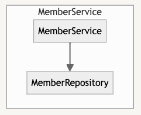
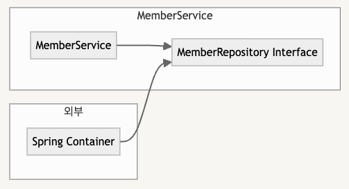

#### 날짜: 2024-06-05

<br/>

### 🌤️ 스크럼

-   학습 목표 1 : IoC, DI 개념 이해하기

<br/>

### ⚡️ 새로 배운 내용

#### [Spring] IoC

Inversion of Control, 제어의 역전

-   객체의 생성과 생명주기 관리를 개발자가 아닌 프레임워크가 담당하는 것
-   코드의 **결합도를 낮추고,** 유지보수성을 높인다.

    -   개발자는 비즈니스 로직 구현에 집중할 수 있고, 객체 생성과 관리의 복잡성에서 벗어날 수 있기 때문이다.

-   의존 관계가 느슨해져 변경에 **유연하게 대응** 할 수 있다.
-   인터페이스 기반으로 개발하여 **코드 재사용성을 높일 수 있다.**

<br/>

-   사용 방법

    -   `@Component`, `@Service`, `@Repository`, `@Controller` 어노테이션을 사용하여 스프링 컨테이너에 빈으로 등록한다.

-   예시

    -   ❌ 직접 객체 생성

        ```java
        public class MemberService {
            // 직접 의존성 생성
            private MemberRepository memberRepository = new MemberRepositoryImpl();

            public void register(Member member) {
                memberRepository.save(member);
            }
        }
        ```

        

        -   `MemberService`가 `MemberRepsitory`를 직접 생성하고 사용한다.

    -   ⭕️ IoC 컨테이너 사용

        ```java
        public class MemberService {
          // 인터페이스 타입으로 의존성 선언
          private MemberRepository memberRepository;

          // 생성자를 통해 의존성 주입 및 DI 발생
          public MemberService(MemberRepository memberRepository) {
              this.memberRepository = memberRepository;
          }

          public void register(Member member) {
              memberRepository.save(member);
          }
        }
        ```

        

        -   `MemberService`는 `MemberRepository` 인터페이스에 의존한다.
        -   `Spring Container`가 `MemberRepository` 구현체를 생성하고, `MemberService`에 주입한다.

<br/>

#### [Spring] DI

Dependency Injection, 의존성 주입

-   직접 의존 객체를 생성하거나 관리하지 않고, 외부에서 주입받아 사용하는 것
-   **IoC를 구현하는 방법 중 하나이다.**
-   `@Autowired` 어노테이션을 사용하여 의존성을 주입한다.

-   예시

    ```java

    // UserService.java
    @Service
    public class UserServiceImpl implements UserService {
        private final UserRepository userRepository;
        private final PostService postService;

        // 이게 끝이다.
        @Autowired
        public UserService(UserRepository userRepository, PostService postService) {
            this.userRepository = userRepository; // 스프링이 UserRepositoryImpl 클래스를 주입해준다.
            this.postService = postService; // 스프링이 PostServiceImpl 클래스를 주입해준다.
        }
        // ... some code~~~~
    }

    // UserRepository.java
    @Repository
    public interface UserRepository {
      void findById(int id);
      // some code.. ~~
    }

    // UserService.java
    public interface UserService {
      // ... some code ~~~
    }

    // PostService
    public interface PostService {
      // ... some code ~~~
    }

    // PostServiceImpl
    @Service
    public class PostServiceImpl implements PostService {
        // .. do something!
    }

    ```

<br/>

#### [Spring] IoC/DI 컨테이너

IoC/DI를 구현한 컨테이너

-   애플리케이션의 객체를 생성하고, 이들 간의 의존성을 관리한다.
-   개발자는 XML, 어노테이션, 자바 설정 파일 등을 통해 객체의 생성과 의존성을 설정할 수 있다.
-   컨테이너는 `ApplicationContext` 인터페이스를 구현한 다양한 방식으로 제공되며, 개발자는 상황에 맞는 구현체를 선택할 수 있다.

<br/>

### ~~🔥 오늘의 도전 과제와 해결 방법~~

<br/>

### 🤔 오늘의 회고

-   스크럼 중 완료한 작업: `IoC, DI 개념 이해하기`
-   IoC와 DI의 코드 예시를 보며 어떻게 활용해야 하는지 이해했다.
-   직접 사용해보면서 감을 익혀야 할 것 같다.

<br/>

### 참고 자료 및 링크

-   [IoC/DI 컨테이너의 이해](https://f-lab.kr/insight/understanding-spring-framework-and-ioc-di-container?gad_source=1&gclid=Cj0KCQjwj9-zBhDyARIsAERjds3wx4P67oHB0NDRiSeK2mkOBih0zbRNWIuaqxYIDffekaXauozF6kQaAgAREALw_wcB)
-   수업 교재
