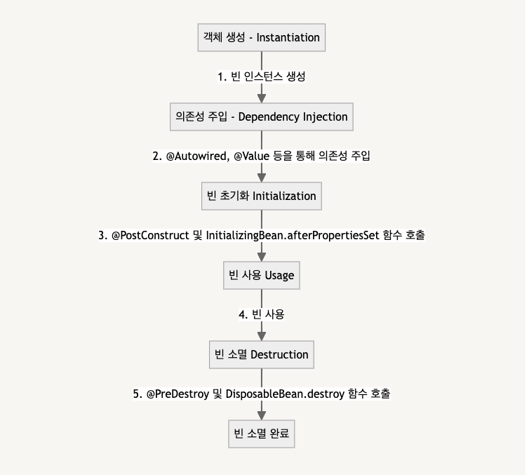

#### 날짜: 2024-06-07

<br/>

### 🌤️ 스크럼

-   학습 목표 1 : 빈 라이프사이클 이해하기

<br/>

### ⚡️ 새로 배운 내용

#### [Spring Boot] 빈 라이프사이클

> **빈 (Bean)**  
> 스프링 IoC 컨테이너가 관리하는 객체

> **빈 생명주기**  
> 빈 객체가 생성되고, 초기화되고, 소멸되는 과정

-   빈 생명주기의 중요성
    -   효율적인 자원 관리  
        자원(db 연결, 파일 핸들 등)의 적절한 할당과 해제가 가능해진다. 이를 통해 애플리케이션의 성능과 안정성을 향상시킬 수 있다.

<br/>



**1. 빈 인스턴스화 (Instantiation)**

-   빈 객체가 생성되는 단계
-   빈 객체를 생성하기 위해 빈 클래스의 인스턴스를 생성하는 단계
-   `@Component`, `@Bean` 어노테이션이 사용될 수 있다.

    ```java
    @Component
    public class Engine {
      public class Engine() {
        System.out.println("Engine 빈이 인스턴스화되었습니다.");
      }
    }
    ```

    ```
    새로운 자동차를 공장에서 만들 때, 자동차의 틀을 만드는 단계
    ```

**2. 의존성 주입 (Dependency Injection)**

-   빈 객체가 생성된 후, 의존성 주입을 받는 단계
-   빈이 제대로 동작하려면 필요한 의존성을 주입받아야 한다. 이를 통해 빈이 독립적으로 설계되고 유지보수성이 높아진다.

    ```java
    @Component
    public class Car {
      private Engine engine;

      @Autowired
      public Car(Engine engine) {
        this.engine = engine;
        System.out.println("Car 빈이 의존성 주입을 받았습니다.");
      }
    }
    ```

    ```
    자동차에 엔진, 타이어, 시트 등 부품을 장착하는 단계
    ```

**3. 초기화 (Initialization)**

-   빈 객체가 생성되고 의존성 주입이 완료된 후, 추가 초기화 작업을 수행하는 단계
-   `@PostConstruct` 어노테이션이나 InitializingBean 인터페이스의 `afterPropertiesSet()` 메서드를 사용할 수 있다.

    ```java
    @Component
    public class Car {
      private Engine engine;

      @Autowired
      public Car(Engine engine) {
        this.engine = engine;
        System.out.println("Car 빈이 의존성 주입을 받았습니다.");
      }

      @PostConstruct
      public void init() {
        System.out.println("Car 빈이 초기화되었습니다.");
      }

      public void drive() {
        System.out.println("Car가 주행합니다.");
      }
    }
    ```

    ```
    자동차를 출고하기 전에 최종 점검하고 세부 조정을 하는 과정
    ```

**4. 사용 (Usage)**

-   빈이 실제로 애플리케이션에서 사용되는 단계
-   빈이 필요할 때마다 Spring 컨테이너에서 빈을 가져와 사용한다.

    ```java
    @Component
    public class Car {
      // 필드 주입
      @Autowired
      private Engine engine;

      public void performTask() {
        engine.drive();
      }
    }
    ```

    ```
    자동차를 운전하는 단계
    ```

**5. 소멸 (Destruction)**

-   애플리케이션이 종료되거나 빈이 더이상 필요하지 않게 되어 소멸되는 단계
-   자원을 해제하고 메모리를 정리하여 메모리 누수를 방지한다.
-   `@PreDestroy` 어노테이션이나 DisposableBean 인터페이스의 `destroy()` 메서드를 사용할 수 있다.

    ```java
    @Component
    public class Engine {
      @Predestroy
      public void destroy() {
        System.out.println("Engine 빈이 소멸되었습니다.");
      }
    }
    ```

    ```
    자동차를 폐차하거나 재활용하는 단계
    ```

<br/>

### ~~🔥 오늘의 도전 과제와 해결 방법~~

<br/>

### 🤔 오늘의 회고

-   스크럼 중 완료한 작업: `빈 라이프사이클 이해하기`
-   빈을 어떻게 생성하고, 어떻게 사용하고, 어떻게 소멸시키는지 이해할 수 있었다.

<br/>

### 참고 자료 및 링크

-   제푸의 강의자료
