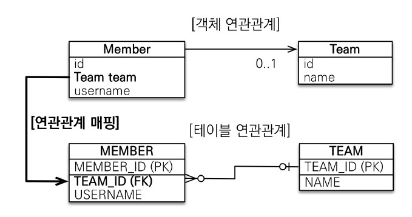
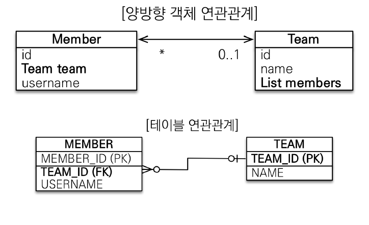

#### 날짜: 2024-06-11

<br/>

### 🌤️ 스크럼

-   학습 목표 1 : JPA 매핑 이해하기

<br/>

### ⚡️ 새로 배운 내용

#### [Spring Boot] JPA 매핑

-   **Entity 매핑**

    -   `@Entity`  
        테이블과 매핑할 클래스에 사용
    -   `@Table`
        엔티티와 매핑할 테이블을 지정
    -   `@Column`
        필드와 매핑할 테이블의 컬럼을 지정
    -   `@Enumerated`
        자바 enum 타입을 매핑할 때 사용
    -   `@Temporal`
        날짜 타입을 매핑할 때 사용
    -   `@Transient`
        특정 필드를 DB에 매핑하지 않을 때 사용
    -   `@Access`
        엔티티의 필드에 접근하는 방식을 지정
        -   `AccessType.FIELD`  
            필드에 직접 접근
        -   `AccessType.PROPERTY`  
            getter를 사용하여 접근
        -   `AccessType.FIELD`  
            필드와 getter를 모두 사용하여 접근

-   **기본 키 매핑**

    -   `@Id`
        엔티티의 기본 키를 지정
    -   `@GeneratedValue`
        기본 키의 값을 자동 생성

        -   `GenerationType.AUTO`  
            DB에 따라 자동 지정
        -   `GenerationType.IDENTITY`  
            기본 키 생성을 DB에 위임
            -   주로 MySQL, PostgreSQL, SQL Server, DB2에서 사용한다.
        -   `GenerationType.SEQUENCE`  
            DB 시퀀스를 사용하여 기본 키 생성

            <details>
            <summary>DB 시퀀스란?</summary>
            유일하고 순차적인 숫자 값을 생성하는 데이터베이스 오브젝트

            -   주로 기본 키와 같은 유일한 식별자를 생성할 때 사용된다.
            </details>

            -   주로 Oracle, PostgreSQL, DB2, H2에서 사용한다.

        -   `GenerationType.TABLE`  
            키 생성 전용 테이블을 사용하여 기본 키 생성

-   **연관관계 매핑**

    -   `@ManyToOne`
        다대일 관계를 매핑할 때 사용
    -   `@OneToMany`
        일대다 관계를 매핑할 때 사용
        -   `mappedBy`
            연관되는 엔티티의 필드명을 지정
    -   `@OneToOne`
        일대일 관계를 매핑할 때 사용
    -   `@ManyToMany`
        다대다 관계를 매핑할 때 사용
    -   `@JoinColumn`
        외래키 매핑에 사용

    <br/>

    -   **단방향, 양방향 매핑**

        -   **`단방향`**  
            한 엔티티만 참조하는 것
            

            `Member.java`

            ```java
            @Entity
            public class Member {
                @Id
                @GeneratedValue
                @Column(name = "member_id")
                private Long id;

                @Column(name = "username")
                private String name;

                @ManyToOne // Member가 여러개, Team이 하나
                @JoinColumn(name = "team_id")
                private Team team;
            }
            ```

            Team 엔티티를 멤버 변수로 등록하여 엔티티 간 관계를 맺는다.

            `Team.java`

            ```java
            @Entity
            public class Team {
                @Id
                @GeneratedValue
                @Column(name = "team_id")
                private Long id;

                @Column(name = "teamname")
                private String name;
            }
            ```

            `Main.java`

            ```java
            Team team = new Team();
            team.setName("TeamA");
            em.persist(team);

            Member member = new Member();
            member.setName("member1");
            member.setTeam(team);
            em.persist(member);
            ```

            Member 엔티티에 Team 엔티티를 등록하여 연관관계를 맺는다.

            <br/>

        -   **`양방향`**
            두 엔티티가 서로 참조하는 것

            -   규칙
                -   객체의 두 관계 중 하나를 연관관계 주인으로 지정한다.
                -   연관관계의 주인만이 외래 키를 관리(등록, 수정)한다.
                -   주인이 아닌 쪽은 읽기만 가능하다.
                -   주인은 mappedBy 속성을 사용하지 않는다.
                -   주인이 아닌 쪽은 mappedBy 속성을 사용하여 주인을 지정한다.

            

            `Member.java`

            ```java
            @Entity
            public class Member {
                @Id
                @GeneratedValue
                @Column(name = "member_id")
                private Long id;

                @Column(name = "username")
                private String name;

                @ManyToOne
                @JoinColumn(name = "team_id")
                private Team team;
            }
            ```

            `Team.java`

            ```java
            @Entity
            public class Team {
                @Id
                @GeneratedValue
                @Column(name = "team_id")
                private Long id;

                @Column(name = "teamname")
                private String name;

                @OneToMany(mappedBy = "team") // Member 엔티티의 team 필드와 매핑
                private List<Member> members = new ArrayList<>();

                public List<Member> getMembers() {
                    return members;
                }
            }
            ```

            연관되는 서로의 객체를 멤버 변수로 등록하여 양방향 관계를 맺는다.

            `Main.java`

            ```java
            Team team = new Team();
            team.setName("TeamA");
            em.persist(team);

            Member member = new Member();
            member.setName("member1");

            team.getMembers().add(member);
            member.setTeam(team);

            Member findMember = em.find(Member.class, member.getId()); // 조회
            List<Members> members = findMember.getTeam().getMembers();

            for (Member m : members) {
                System.out.println("member.name = " + m.getName());
            }
            ```

            `Member` 엔티티의 `team` 필드와 `Team` 엔티티의 `members` 필드를 서로 참조하도록 설정하여 양방향 관계를 맺는다.

            <br/>

        -   `주인`
            외래 키가 있는 엔티티
            -   객체 양방향 연관관계는 관리 주체가 필요하다.

<br/>

### 🔥 오늘의 도전 과제와 해결 방법

#### 도전 과제 1: MySQL과 스프링 연동하기

-   **프로젝트 구성**

    -   `Entity`
        데이터베이스 테이블과 매핑되는 클래스입니다. 주로 데이터베이스의 구조를 정의합니다.

        -   예시: User 클래스는 users 테이블과 매핑됩니다.

    -   `Repository`
        데이터베이스와 직접 소통하는 인터페이스입니다. CRUD (생성, 읽기, 업데이트, 삭제) 작업을 수행합니다.

        -   예시: UserRepository 인터페이스는 User 엔터티에 대한 데이터베이스 작업을 처리합니다.

    -   `DTO` (Data Transfer Object)
        컨트롤러와 서비스 간의 데이터를 전송하는 객체입니다. 주로 뷰와 컨트롤러 간의 데이터 교환에 사용됩니다.

        -   예시: UserDTO 클래스는 클라이언트로부터 입력 받은 데이터를 서비스 계층에 전달하거나, 서비스 계층에서 처리된 데이터를 클라이언트에 반환할 때 사용됩니다.

    -   `Service`
        비즈니스 로직을 처리하는 클래스입니다. 주로 데이터베이스와의 상호작용을 담당합니다.
        -   예시: UserService 클래스는 User 엔터티에 대한 비즈니스 로직을 처리합니다.

    <br/>

    > _로직 예시_  
    > `UserDTO` (-> `UserEntity`) -> `UserService` -> `UserRepository` -> MySQL 데이터베이스
    >
    > 1. 컨트롤러에서 요청을 받는다.
    >    예를 들어, 회원가입 요청이 들어오면, 컨트롤러는 `UserDTO` 객체를 사용하여 입력 데이터를 받는다.
    > 2. 컨트롤러는 받은 데이터를 서비스 계층으로 전달한다.
    >    `UserDTO` 객체를 `UserEntity` 엔터티로 변환하여 `UserService` 계층으로 전달할 수 있다.
    > 3. 서비스 계층은 비즈니스 로직을 처리한다.
    >    `UserService` 에서 `UserRepository`를 사용하여 데이터베이스 작업을 수행한다.
    >    예를 들어, 새로운 유저를 생성하고 저장한다.
    > 4. 레포지토리가 데이터베이스와 소통한다.
    >    `UserRepository`는 데이터베이스에 접근하여 CRUD 작업을 수행한다.
    >    예를 들어, 새로운 유저 정보를 데이터베이스에 저장한다.

<br/>

### 🤔 오늘의 회고

-   스크럼 중 완료한 작업: `JPA 매핑 이해하기`
-   JPA를 직접 코드에서 어떻게 사용할 수 있는지와 연관관계를 매핑하는 방법을 알게 되었다. 양방향 매핑을 사용하면 객체 간의 관계를 더욱 유연하게 표현할 수 있다. 이제 MySQL과 스프링을 연동하여 실제로 데이터베이스에 데이터를 저장하고 조회하는 작업을 해보고 싶다.

<br/>

### 참고 자료 및 링크

-   [JPA와 DB 연관관계](https://velog.io/@heyday_7/JPA%EC%99%80-DB-relation)
-   [JPA 연관관계의 주인, 양방향 매핑 정리](https://scoring.tistory.com/entry/JPA-%EC%96%91%EB%B0%A9%ED%96%A5-%EC%97%B0%EA%B4%80%EA%B4%80%EA%B3%84%EC%99%80-%EC%97%B0%EA%B4%80%EA%B4%80%EA%B3%84%EC%9D%98-%EC%A3%BC%EC%9D%B8-%EC%96%91%EB%B0%A9%ED%96%A5-%EB%A7%A4%ED%95%91-%EC%A0%95%EB%A6%AC)
-   [MySQL DB와 연동하기](https://changha-dev.tistory.com/147)
