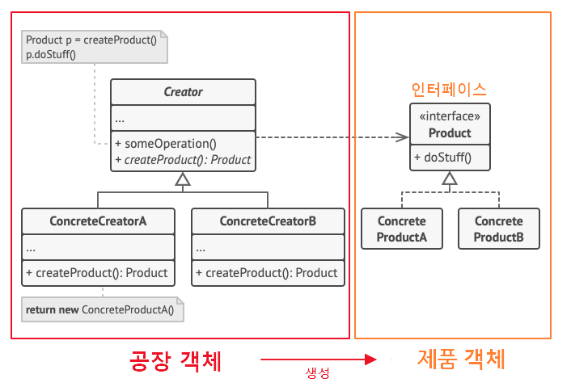
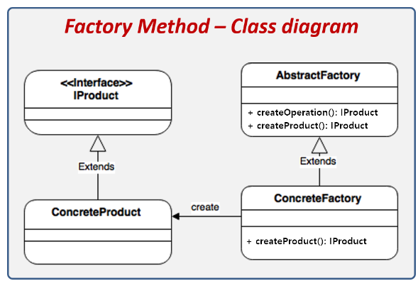
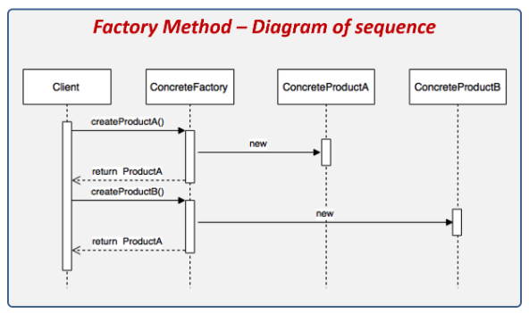

#### 날짜: 2024-05-29

<br/>

### 🌤️ 스크럼

-   학습 목표 1 : `팩토리 메서드 패턴` 이해하기

<br/>

### ⚡️ 새로 배운 내용

#### [Spring] 팩토리 메서드 패턴

객체 생성을 추상화하고 캡슐화하는 디자인 패턴

-   직접 `new` 연산자로 `제품 객체`를 생성하는 것이 아닌, 객체를 도맡아 생성하는 `공장 클래스`를 만들고, 이를 상속하는 `서브 공장 클래스`의 메서드에서 여러가지 `제품 객체` 생성을 각각 책임지는 것이다.
-   객체 생성에 필요한 과정을 템플릿처럼 미리 구성해놓고, 객체 생성에 관한 전처리나 후처리를 통해 생성과정을 다양하게 처리하여 유연하게 정할 수 있는 특징이 있다.

<br/>

-   **구조**
    
    팩토리 객체와 제품 객체 간에 느슨한 결합 구조로 되어 있다.

    -   **`Creator`**

        최상위 공장 클래스로, 팩토리 메서드를 추상화하여 제품 객체를 생성하는 메서드를 정의한다.

        -   객체 생성 처리 메서드 (`someOperation`)  
            제품 객체를 생성하는 메서드
        -   팩토리 메서드 (`createProduct()`)
            서브 공장 클래스에서 재정의할 객체 생성 추상 메소드

    -   **`ConcreteCreator`**

        `Creator` 클래스를 상속받아 구현한 서브 공장 클래스로, `Creator` 클래스의 팩토리 메서드를 구현한다.

        -   각 서브 공장 클래스들은 이에 맞는 제품 객체를 반환하도록 추상 메소드를 재정의한다. 즉, 제품 객체 하나당 서브 공장 클래스 하나가 존재한다.

    -   **`Product`**

        제품 객체를 나타내는 인터페이스로, 팩토리 메서드 패턴에서 생성되는 객체를 나타낸다.

    -   **`ConcreteProduct`**

        `Product` 인터페이스를 구현한 제품 객체 클래스로, `ConcreteCreator` 클래스에서 생성된다.

<br/>

-   **사용 예시**

    

    -   제품(Product) 클래스

        ```java
        // 제품 객체 추상화 (인터페이스)
        interface IProduct {
            void setting();
        }

        // 제품 구현체
        class ConcreteProductA implements IProduct {
            public void setting() {
            }
        }

        class ConcreteProductB implements IProduct {
            public void setting() {
            }
        }
        ```

    -   공장(Factory) 클래스

        ```java
        // 공장 객체 추상화 (추상 클래스)
        abstract class AbstractFactory {

            // 객체 생성 전처리 후처리 메소드 (final로 오버라이딩 방지, 템플릿화)
            final IProduct createOperation() {
                IProduct product = createProduct(); // 서브 클래스에서 구체화한 팩토리 메서드 실행
                product.setting(); // .. 이밖의 객체 생성에 가미할 로직 실행
                return product; // 제품 객체를 생성하고 추가 설정하고 완성된 제품을 반환
            }

            // 팩토리 메소드 : 구체적인 객체 생성 종류는 각 서브 클래스에 위임
            // protected 이기 때문에 외부에 노출이 안됨
            abstract protected IProduct createProduct();
        }

        // 공장 객체 A (ProductA를 생성하여 반환)
        class ConcreteFactoryA extends AbstractFactory {
            @Override
            public IProduct createProduct() {
                return new ConcreteProductA();
            }
        }

        // 공장 객체 B (ProductB를 생성하여 반환)
        class ConcreteFactoryB extends AbstractFactory {
            @Override
            public IProduct createProduct() {
                return new ConcreteProductB();
            }
        }
        ```

-   **클래스 흐름**
    
    

<br/>

-   **사용하는 이유**

    -   클래스 생성과 사용의 처리 로직을 분리하여 객체 간의 **결합도를 낮추기 위해**
    -   객체 생성 로직의 변경이나 확장에 유연하게 대처하기 위해
    -   코드가 동작해야 하는 객체의 유형과 종속성을 캡슐화를 통해 **정보 은닉을 하기 위해**
    -   스프링과 같은 프레임워크에서 의존성 주입을 통해더 깔끔한 코드 관리가 가능하다.

-   **장점**

    -   생성자(Creater)와 구현 객체(Concrete Product)의 강한 결합을 피할 수 있다.
    -   팩토리 메서드를 통해 객체의 생성 후, 공통으로 할 일을 수행하도록 지정해줄 수 있다.
    -   `단일 책임 원칙`을 준수하여 객체 생성을 한 곳(패키지, 클래스)으로 집중시킬 수 있다.
    -   `개방/폐쇄 원칙`을 준수하여, 기존 코드를 수정하지 않고 새로운 제품 객체를 추가할 수 있다.

-   **단점**

    -   팩토리 메서드 패턴을 사용하면 객체 생성을 위한 클래스가 많아지고, 클래스 간의 관계가 복잡해질 수 있다.

-   [팩토리 메서드 적용 예제](https://inpa.tistory.com/entry/GOF-%F0%9F%92%A0-%ED%8C%A9%ED%86%A0%EB%A6%AC-%EB%A9%94%EC%84%9C%EB%93%9CFactory-Method-%ED%8C%A8%ED%84%B4-%EC%A0%9C%EB%8C%80%EB%A1%9C-%EB%B0%B0%EC%9B%8C%EB%B3%B4%EC%9E%90#%EC%98%88%EC%A0%9C%EB%A5%BC_%ED%86%B5%ED%95%B4_%EC%95%8C%EC%95%84%EB%B3%B4%EB%8A%94_factory_method_%ED%8C%A8%ED%84%B4)

<br/>

### ~~🔥 오늘의 도전 과제와 해결 방법~~

<br/>

### 🤔 오늘의 회고

-   스크럼 중 완료한 작업: `팩토리 메서드 패턴` 이해하기
-   개념적으로는 이해했지만, 실제로 코드로 구현해보지 않아서 와닿지는 않는 것 같다. 실제로 내가 적용해볼 수 있는 기회가 있으면 좋을 것 같다.
-   팩토리 메서드 패턴은 객체 생성을 추상화하여 객체 생성에 대한 책임을 서브 클래스로 위임하는 디자인 패턴이다.
-   `추상 팩토리 패턴`과 `팩토리 메서드 패턴`의 차이점을 알아두면 좋을 것 같다.

<br/>

### 참고 자료 및 링크

-   [[인파dev] 팩토리 메서드 패턴](https://inpa.tistory.com/entry/GOF-%F0%9F%92%A0-%ED%8C%A9%ED%86%A0%EB%A6%AC-%EB%A9%94%EC%84%9C%EB%93%9CFactory-Method-%ED%8C%A8%ED%84%B4-%EC%A0%9C%EB%8C%80%EB%A1%9C-%EB%B0%B0%EC%9B%8C%EB%B3%B4%EC%9E%90)
