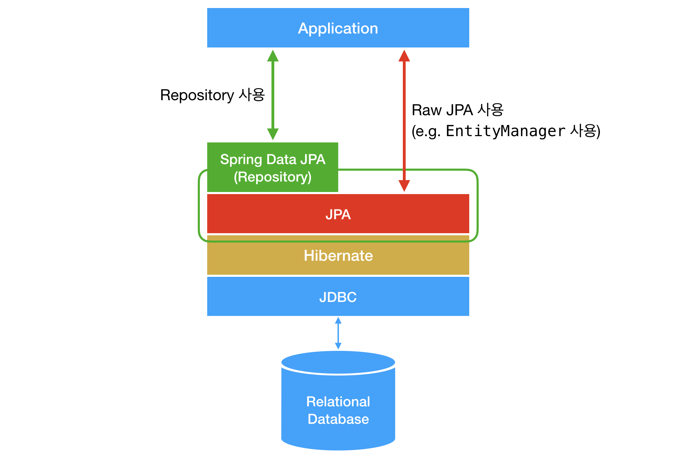
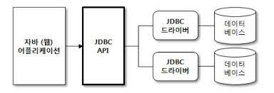

#### 날짜: 2024-06-14

<br/>

### 🌤️ 스크럼

-   학습 목표 1 : `JPA`, `Hibernate`, `JDBC`의 차이점 이해하기

<br/>

### ⚡️ 새로 배운 내용



#### [Spring Boot] JDBC

Java Database Connectivity
DBMS 종류와 무관하게 DB 관련 작업을 할 수 있도록 하는 자바 API



-   JDBC API는 설정한 데이터베이스에 맞는 드라이버를 사용하여 데이터베이스에 연결하고, SQL 쿼리를 실행하고, 결과를 처리하는 방법을 제공한다.
-   즉, JDBC는 인터페이스이고, 이를 구현한 것은 각 DBMS 벤더들이 제공하는 드라이버이다.
-   JPA, Hibernate와 다르게 JDBC는 **SQL을 직접 작성해야 한다.**

```java
public class JdbcExample {
    public static void main(String[] args) {
        Connection conn = null;
        Statement stmt = null;
        ResultSet rs = null;

        try {
            // 1. 드라이버 로딩
            Class.forName("com.mysql.cj.jdbc.Driver");

            // 2. 연결
            String url = "jdbc:mysql://localhost:3306/test";
            conn = DriverManager.getConnection(url, "root", "1234");

            // 3. 쿼리 수행
            stmt = conn.createStatement();
            rs = stmt.executeQuery("SELECT * FROM test");

            // 4. 결과 처리
            while (rs.next()) {
                System.out.println(rs.getString("name"));
            }
        } catch (Exception e) {
            e.printStackTrace();
        } finally {
            // 5. 자원 해제
            try {
                if (rs != null) rs.close();
                if (stmt != null) stmt.close();
                if (conn != null) conn.close();
            } catch (SQLException e) {
                e.printStackTrace();
            }
        }
    }
}
```

-   장점
    -   SQL의 직접적인 제어가 가능하여 예상치 못한 문제(N+1 문제 등)가 잘 발생하지 않는다.
        -   N+1 문제: 1:N 관계에서 N개의 데이터를 가져올 때, 1개의 데이터를 가져오는 쿼리가 N번 실행되는 문제
    -   복잡한 쿼리 처리가 가능하다.
-   단점
    -   반복적인 코드가 발생하며, 직접 SQL을 작성해야 한다.
    -   객체지향적인 코드 작성이 어렵다.

<br/>

#### [Spring Boot] JPA

Java Persistence API
자바 ORM 기술에 대한 API 표준 명세로, 자바 개발자들이 객체와 관계형 데이터베이스를 매핑하는 방법을 제공한다.


-   JPA는 인터페이스이고, 이를 구현한 것은 **`Hibernate`**, EclipseLink, DataNucleus 등이 있다.
-   JPA는 객체지향적인 코드로 데이터베이스를 다룰 수 있게 해준다.
-   JPA는 SQL을 직접 작성하지 않아도 된다.

```java
@Entity
public class Member {
    @Id
    @GeneratedValue(strategy = GenerationType.IDENTITY)
    private Long id;
    private String name;
}
```

-   장점
    -   객체지향적인 코드 작성이 가능하다.
    -   쿼리를 직접 작성하지 않기 때문에 실수를 방지할 수 있다.
    -   관계형 데이터베이스와 객체의 **패러다임 불일치 문제를 해결** 할 수 있고, **영속성 컨텍스트를 제공** 한다.
        -   `패러다임 불일치 문제`: 객체지향 프로그래밍 언어와 관계형 데이터베이스의 데이터를 다루는 방식의 차이
        -   `영속성 컨텍스트`: 엔티티를 영구 저장하는 환경
-   단점
    -   JPA를 사용하면서 발생하는 성능 이슈를 해결하기 위해 SQL을 직접 작성해야 할 때가 있다.

<br/>

#### [Spring Boot] Hibernate

JPA를 구현한 ORM 프레임워크 중 하나

> `ORM(Object-Relational Mapping)`은 객체와 관계형 데이터베이스의 데이터를 자동으로 매핑해주는 것을 말한다.

-   JPA 사양에서 설정한 규칙을 따른다.

#### [Spring Boot] Spring Data JPA

JPA를 쉽게 사용할 수 있도록 도와주는 프레임워크

-   JPA를 한 단계 추상화시킨 Repository 인터페이스를 제공한다.
-   Repository 인터페이스를 상속받아 구현체를 만들면, 기본적인 CRUD 메서드를 자동으로 생성하여 Bean으로 등록해준다.

    ```java
    public interface MemberRepository extends JpaRepository<Member, Long> {
    }
    ```

-   장점
    -   JPA를 쉽게 사용할 수 있다.
    -   기본적인 CRUD 메서드를 자동으로 생성해준다.
-   단점
    -   복잡한 쿼리를 작성할 때는 직접 SQL을 작성해야 한다.

<br/>

#### 관계

-   `JPA`와 `Hibernate`  
     JPA는 인터페이스이고, 이를 구현한 것이 Hibernate이다. Hibernate가 추가 기능으로 JPA를 확장한 것이다.

-   `JPA`와 `JDBC`
    JDBC는 JPA가 구축하는 하위 수준 기반으로, JPA는 JDBC를 사용하여 데이터베이스와 통신한다.

-   `Hibernate`와 `JDBC`
    Hibernate는 JDBC를 사용하여 데이터베이스와 통신한다.

<br/>

### ~~🔥 오늘의 도전 과제와 해결 방법~~

<br/>

### 🤔 오늘의 회고

-   스크럼 중 완료한 작업: `JPA`, `Hibernate`, `JDBC`의 차이점에 대해 이해하기
-   JPA, Hibernate, JDBC가 각각 어떤 것이고, 관계가 어떻게 되는지 이해할 수 있었다.
-   Hibernate는 JPA의 구현체이며, JPA는 JDBC를 사용하여 데이터베이스와 통신한다.

<br/>

### 참고 자료 및 링크

-   [Java에서 데이터베이스 액세스의 신비 해제: JPA, Hibernate, JDBC 및 Spring Data](https://www.linkedin.com/pulse/demystifying-database-access-java-jpa-hibernate-jdbc-ali-gb7uf/)

-   [JDBC, JPA, Hibernate, Spring Data JPA 차이
    ](https://velog.io/@pppp0722/JDBC-JPA-Hibernate-Spring-Data-JPA-%EC%B0%A8%EC%9D%B4)
