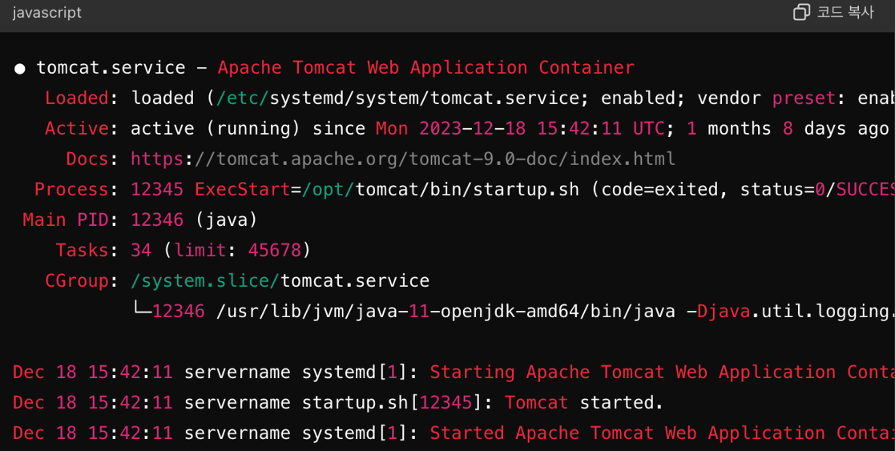

#### 날짜: 2024-06-26

<br/>

### 🌤️ 스크럼

-   학습 목표 1 : 리눅스 명령어 익숙해지기

<br/>

### ⚡️ 새로 배운 내용

#### [Linux] 리눅스 명령어 정리

**1. Zulu OpenJDK 설치 및 Tomcat 설정**

1. **Zulu OpenJDK 설치**

    <br/>

    **✅ `APT`, `GPG`**

    ```bash
    # 인증 키 가져오기
    # apt-key adv [옵션] --keyserver [키 서버 URL] --recv-keys [키 ID]

    sudo apt-key adv --keyserver hkp://keyserver.ubuntu.com:80 --recv-keys 0xB1998361219BD9C
    ```

    - `APT` : Debian 기반 리눅스 시스템에서 소프트웨어 패키지를 관리하는 도구이다.

    - `GPG` : 데이터를 암호화하고 서명하는 데 사용하는 도구로, 소프트웨어 패키지의 신뢰성을 보장하기 위해 널리 사용된다. (ex.0xB1998361219BD9C)
      특정 GPG 키를 키 서버로부터 가져와서 APT 패키지 관리 시스템에 추가하는 작업을 수행한다.

    <br/>

    **✅ `curl -sO`**

    ```bash
    # Repository 패키지 설치
    curl -sO https://cdn.azul.com/zulu/bin/zulu-repo_1.0.0-3_all.deb
    ```

    **`curl -s`**

    Silent 모드로 실행하여 진행 상태나 오류 메시지를 출력하지 않는다.

    **`curl -O`**

    원격 서버의 파일을 로컬 시스템에 저장할 때 원격 파일의 이름을 그대로 사용하여 저장한다.

    <br/>

    ✅ **`apt-get`**

    ```bash
    # Repository 패키지 설치
    sudo apt-get install -y ./zulu-repo_1.0.0-3_all.deb

    # 패키지 목록 업데이트
    sudo apt-get update

    # Zulu OpenJDK 설치
    sudo apt-get install zulu17-jdk -y
    java -version
    ```

    `apt-get`은 Debian 기반의 시스템(예: Ubuntu)에서 패키지를 관리하기 위해 사용하는 명령어이다. `apt-get` 명령어는 새로운 소프트웨어 패키지를 설치하거나, 이미 설치된 패키지를 업그레이드 또는 제거할 때 사용된다.

    - 설치 (install)
      `apt-get install` 명령어는 지정한 패키지를 설치한다. 의존성이 있는 다른 패키지가 있다면 함께 설치한다.
    - 업데이트 (update)
      `apt-get update` 명령어는 패키지 인덱스 파일을 업데이트한다. 이 명령어를 실행하면 패키지 저장소의 최신 목록을 다운로드하여 로컬 캐시에 저장한다.

    <br/>

    **✅ `apt-cach`e**

    ```bash
    # zulu 패키지 잘 추가되었는지 확인 후 설치
    # apt에 등록된 zulu 리포지토리에 zulu17 패키지가 존재하는지 확인
    sudo apt-cache search zulu17
    ```

    `apt-cache`는 로컬 패키지 캐시에 저장된 패키지 정보를 검색하거나 조회하여 제공한다.

    - 조회 (search)
      `apt-cache search` 명령어는 지정된 키워드와 일치하는 패키지 이름과 설명을 검색한다.

    <br/>

2. **Tomcat 설치**

    <br/>

    ✅ **`mkdir -pv`**

    ```bash
    # Tomcat 설치 폴더 생성 및 사용자 설정
    sudo mkdir -pv /app/tomcat
    ```

    **`mkdir -p`**

    상위 디렉토리가 존재하지 않을 경우, 상위 디렉토리까지 모두 생성한다. 이미 존재하는 디렉토리에 대해 에러를 출력하지 않는다.

    **`mkdir -v`**

    생성되는 각 디렉토리에 대해 메시지를 출력한다. "verbose" 모드로 실행되어, 어떤 디렉토리가 생성되었는지 출력한다.

    <br/>

    **✅ `groupadd`**

    ```bash
    # Tomcat 설치 폴더 생성
    sudo groupadd tomcat
    ```

    - `groupadd`: 새로운 그룹을 생성하는 명령어
    - `tomcat`: 생성할 그룹의 이름

    <br/>

    **✅ `useradd`**

    ```bash
    # Tomcat 사용자 설정
    sudo useradd -s /bin/false -g tomcat -d /app/tomcat tomcat
    ```

    관리자 권한으로 `tomcat` 그룹에 속하는 `tomcat` 사용자를 추가한다. 이 사용자는 로그인이 비활성화되며, 홈 디렉토리는 `/app/tomcat`으로 설정된다.

    - `useradd`: 새로운 사용자를 추가하는 명령어
    - `s /bin/false`: 사용자 로그인을 비활성화
        - 사용자가 로그인 시도 시, 로그인 쉘인 `false` 셸로 인해 셸이 바로 종료된다.
    - `g tomcat`: 사용자를 `tomcat` 그룹에 추가
    - `d /app/tomcat`: 사용자의 홈 디렉토리를 `/app/tomcat`으로 설정
    - `tomcat`: 추가할 사용자의 이름

    <br/>

    ✅ **`wget`**

    ```bash
    # Tomcat 다운로드 및 설치
    cd /opt
    sudo wget https://dlcdn.apache.org/tomcat/tomcat-10/v10.1.24/bin/apache-tomcat-10.1.24.tar.gz
    ```

    `wget`은 인터넷에서 파일을 다운로드할 때 사용하는 명령어이다.

    <br/>

    ✅ **`tar -C`**

    ```bash
    # Tomcat 다운로드 및 설치
    sudo tar xfz apache-tomcat-10.1.24.tar.gz -C /app/tomcat --strip-components=1
    ```

    `tar` 명령어는 파일을 아카이브하거나 압축 해제하는 데 사용된다. `-C` 옵션은 파일을 압축 해제할 디렉토리를 지정한다.

    <br/>

    ✅ **`chown -R`**

    ```bash
    # Tomcat 다운로드 및 설치
    sudo chown -R tomcat: /app/tomcat
    ```

    `chown` 명령어는 파일이나 디렉토리의 소유권을 변경한다. `-R` 옵션은 재귀적으로 디렉토리와 그 안의 모든 파일의 소유권을 변경한다.

    <br/>

    ✅ **`su`**

    ```bash
    # Tomcat 다운로드 및 설치
    sudo su
    ```

    `su` 명령어는 다른 사용자의 권한으로 셸을 실행한다.

    <br/>

    **✅ `chmod`**

    ```bash
    # Tomcat 다운로드 및 설치
    chmod +x /app/tomcat/bin/*.sh
    exit
    sudo /app/tomcat/bin/version.sh
    ```

    `chmod` 명령어는 파일이나 디렉토리의 권한을 변경하는 데 사용된다.

    <br/>

3. **Tomcat 서비스 등록**

    <br/>

    **✅ `vim`**

    ```bash
    # Tomcat 서비스 등록
    sudo vim /etc/systemd/system/tomcat.service

    # 다음 내용을 추가
    [Unit]
    Description=Tomcat servlet container
    After=network.target

    [Service]
    Type=forking
    User=tomcat
    Group=tomcat
    RestartSec=10
    Restart=always
    Environment="JAVA_HOME=/usr/lib/jvm/zulu11"
    Environment="JAVA_OPTS=-Djava.awt.headless=true -Djava.security.egd=file:/dev/./urandom"
    Environment="CATALINA_BASE=/app/tomcat"
    Environment="CATALINA_HOME=/app/tomcat"
    Environment="CATALINA_PID=/app/tomcat/temp/tomcat.pid"
    Environment="CATALINA_OPTS=-Xms256M -Xmx512M -server -XX:+UseParallelGC"
    ExecStart=/app/tomcat/bin/startup.sh
    ExecStop=/app/tomcat/bin/shutdown.sh

    [Install]
    WantedBy=multi-user.target
    ```

    `vim`은 터미널 기반의 텍스트 편집기이다. `vi`의 확장판으로, 프로그래밍 코드 작성 및 파일 편집에 유용하다.

    <br/>

4. **Tomcat 서비스 반영 및 실행**

    <br/>

    **✅ `systemctl`**

    ```bash
    sudo systemctl daemon-reload # systemd에게 유닛 파일의 변경사항을 다시 불러오도록 지시
    sudo systemctl --now enable tomcat # Tomcat 서비스 부팅 시 자동 시작하도록 systemd에 등록

    sudo systemctl status tomcat --no-pager -l # Tomcat 서비스의 현재 상태를 확인
    ```

    

    `systemctl`은 systemd 시스템 및 서비스 관리자로 시스템과 서비스의 상태를 제어하고 확인하는 데 사용된다.

    <br/>

5. **Tomcat 접속**

    `http://{ip주소}:8080`

    <br/>

**2. Nginx 설치, Tomcat과 리버스 프록시로 연결**

1. **Nginx 설치**

    ```bash
    # 패키지 업데이트
    sudo apt update

    # Nginx 설치
    sudo apt install nginx -y
    ```

    ✅ **`-y`**

    설치 중 발생하는 모든 질문에 대해 자동으로 “yes”로 응답하는 역할을 한다. 이 옵션을 사용하면 패키지 설치를 비대화 방식으로 진행할 수 있다.

    <br/>

2. **Nginx 설정**

    ```bash
    # 기본 설정 파일 수정
    sudo vim /etc/nginx/sites-available/default

    # 기본 설정 파일을 열고, 모든 내용을 삭제한 후 아래 내용을 추가
    upstream tomcat { # Tomcat 서버를 정의
        ip_hash; # 동일한 클라이언트를 동일한 서버로 연결 (세션 유지 방식에 유용)
        server 127.0.0.1:8080 max_fails=5 fail_timeout=3s;
        keepalive 300;
    }

    server {
        listen 80 default_server; # Nginx가 클라이언트 요청을 받는 포트
        listen [::]:80 default_server;

        root /app/tomcat/webapps/ROOT; # 정적 리소스  디렉토리
        index index.jsp;

        server_name _;

        charset utf-8;

        location / { # "/" 패턴을 가지는 요청(모든 요청)을 proxy_pass 주소로 포워딩
            proxy_pass http://tomcat;
        }
    }

    # Nginx 설정 확인 및 재시작
    sudo nginx -t # Nginx 설정 파일의 구문 오류를 확인
    sudo service nginx restart # Nginx 서비스를 재시작하여 새로운 설정을 적용
    ```

    ✅ **`nginx -t` 옵션의 역할**

    • **문법 검사**: 설정 파일의 문법 오류를 검사합니다.

    • **유효성 검사**: 설정 파일이 Nginx에서 사용할 수 있는지 확인합니다.

    • **안전한 배포**: 설정 파일이 올바른지 확인하여 안전하게 Nginx를 시작하거나 재시작할 수 있습니다.

<br/>

### ~~🔥 오늘의 도전 과제와 해결 방법~~

<br/>

### 🤔 오늘의 회고

-   스크럼 중 완료한 작업: `리눅스 명령어 익숙해지기`
-   리눅스 기본 명령어들을 배우고, 실습을 통해 익숙해지는 시간을 가졌다.
-   지난번 수업 때 진행했던 실습을 다시 한 번 진행하면서 각 명령어들이 어떤 의미를 가지고 있는지 이해할 수 있었다.

<br/>

### 참고 자료 및 링크

-   [불사조 강의 정리](https://www.notion.so/goorm/Linux-8e2a19fcd180423fbcd233585e4d90ad?pvs=4)
