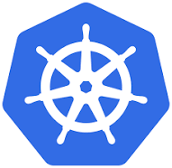

#### 날짜: 2024-06-28

 

### 🌤️ 스크럼

-   학습 목표 1 : AWS Beanstalk vs Kubernetes

 

### ⚡️ 새로 배운 내용

> `AWS Elastic Beanstalk`과 `Google Kubernetes Engine`은 컨테이너 중심 비즈니스에 적합한 두 가지 클라우드 서비스이다.

> **배포 시대의 역사**
>
> **📍 1. 전통적인 배포 시대**
>
> 애플리케이션을 `물리 서버`에서 실행했다.
> 하지만 한 물리 서버에서 여러 애플리케이션의 리소스 한계를 정의할 방법이 없었기에, 리소스 할당의 문제가 발생했다.
>
> **📍2. 가상화된 배포 시대**
>
> 단일 물리 서버의 CPU에서 여러 가상 시스템(VM)을 실행할 수 있게 한다.
> 가상화를 사용하면 VM 간에 애플리케이션을 격리하고, 쉽게 애플리케이션을 추가하거나 업데이트할 수 있고 하드웨어 비용을 절감할 수 있다.
>
> **📍 3. 컨테이너 개발 시대**
>
> 컨테이너는 VM과 유사하지만 격리 속성을 완화하여 애플리케이션 간에 OS를 공유한다. 그러므로 컨테이너는 가볍다고 여겨진다.
> 컨테이너는 아래와 같은 추가적인 혜택을 제공하기 때문에 유명해졌다.
>
> -   이식성 및 일관성(Portability and Consistency)
>     컨테이너는 한 번 작성한 애플리케이션을 어디서든 실행할 수 있게 한다. 랩탑, 온-프레미스 데이터 센터, 퍼블릭 클라우드 등 환경에 관계없이 동일한 컨테이너 이미지를 사용할 수 있다. 이는 `"한 번 개발하고 어디서나 실행"`이라는 원칙을 실현하여, 개발과 운영 환경의 차이로 인한 문제를 줄여준다.
> -   빠르고 효율적인 배포(Quick and Efficient Deployment)
>     컨테이너는 가벼운 이미지로 구성되어 있어, VM 이미지에 비해 생성, 배포 및 확장이 쉽고 빠르다. 이는 개발 속도를 높이고, 새로운 기능을 빠르게 사용자에게 제공할 수 있게 한다. 또한, 컨테이너 이미지의 불변성 덕분에 신속한 롤백이 가능해, 문제가 발생했을 때 빠르게 원래 상태로 복구할 수 있다.
> -   개발과 운영의 분리(Separation of Development and Operations)
>     컨테이너는 애플리케이션과 그 실행 환경을 패키지화하여, 개발과 운영을 명확하게 분리한다. 이는 개발팀이 개발한 그대로 운영팀이 배포할 수 있게 하여, 배포 시 발생할 수 있는 환경 차이로 인한 문제를 줄인다. 또한, 이는 지속적인 통합(CI) 및 지속적인 배포(CD) 파이프라인과 결합되어, 더 빈번하고 안정적인 배포를 가능하게 한다.

 

#### [AWS] AWS Beanstalk

AWS에서 지공하는 완전 관리형 플랫폼 서비스(PaaS)

-   가상화된 배포 시대와 컨테이너 개발 시대 사이의 과도기적 기술로 볼 수 있다.

    -   가상화 기반 관리형 서비스지만, 컨테이너도 지원하기 때문
    -   kubernetes와 같은 고급 컨테이너 오케스트레이션(orchestration)은 지원 x
        -   `오케스트레이션`?
            여러 개의 작업, 서비스, 또는 구성 요소를 **자동으로 관리**하고 조율하여 **일관되고 효율적인 작업 흐름**을 만드는 과정

-   **주요 기능**

    -   `자동화된 관리`:
        -   애플리케이션 코드만 업로드하면 자동으로 인프라를 구성하고, 애플리케이션을 배포하고, 모니터링한다.
    -   `지원하는 언어 및 플랫폼`:
        -   Java, .NET, PHP, Node.js, Python, Ruby, Go 등을 지원하며, Docker 컨테이너도 사용할 수 있다.
    -   `자동 확장 및 로드 밸런싱`:
        -   트래픽 변화에 따라 자동으로 인스턴스를 추가하거나 제거하여 애플리케이션의 확장성을 보장한다.
    -   `모니터링 및 로깅`:
        -   애플리케이션 상태와 성능을 모니터링하고 로그를 제공하여 문제를 쉽게 진단하고 해결할 수 있다.
    -   `환경 구성 및 커스터마이징`:
        -   사용자는 EC2 인스턴스 유형, RDS 데이터베이스, Elastic Load Balancing, Auto Scaling 설정 등을 선택하고 구성할 수 있다.

-   **한계**

    -   많은 것을 자동화하지만, **사용자 지정이 필요한 복잡한 환경**에서는 한계가 있다. 고급 네트워킹 설정이나 세밀한 인프라 제어가 필요한 경우 제한될 수 있다.
    -   Elastic Beanstalk 자체는 추가 비용이 없지만, 생성된 리소스(EC2, RDS, S3 등)에 대한 **비용**은 발생한다.
    -   배포 과정 중에 오류가 발생하면 **디버깅**이 어려울 수 있다.
    -   단일 애플리케이션 배포에는 적합하지만, 다중 서비스나 마이크로서비스 아키텍처를 관리하는 데는 한계가 있다.
    -   AWS에서 제공하는 서비스이므로, 이를 사용하면 AWS에 종속되는 경향이 있습니다. 멀티 클라우드 전략을 고려하는 경우 유연성이 떨어질 수 있다.

 

#### Kubernetes

쿠버네티스

-   컨테이너화된 애플리케이션을 자동화하고 관리하는 오픈소스 플랫폼
    -   `컨테이너화된 애플리케이션`?
        컨테이너 기술을 이용하여 애플리케이션과 그 종속성을 하나의 단위로 패키징한 것
        -   `컨테이너 기술`?
            가상화 기술의 일종으로, 애플리케이션이 실행되는 환경을 독립적으로 격리하여 제공한다.
-   구글에서 개발했으며 현재는 Cloud Native Computing Foundation(CNCF)에서 관리한다.
-   `K8s` 라는 표기는 K와 s 사이에 있는 8글자를 나타내는 약식 표기이다.

> **✅ 그래서 쿠버네티스가 왜 필요한데?**
>
> 프로덕션 환경에서는 애플리케이션을 실행하는 컨테이너를 관리하고 가동 중지 시간이 없는지 확인해야 한다. 쿠버네티스는 분산 시스템을 탄력적으로 실행하기 위한 프레임워크를 제공하여, 배포를 쉽게 관리할 수 있다.

-   **주요 기능**

    -   `서비스 디스커버리와 로드 밸런싱` 
        쿠버네티스는 DNS 이름을 사용하거나 자체 IP 주소를 사용하여 컨테이너를 노출할 수 있다. 컨테이너에 대한 트래픽이 많으면, 쿠버네티스는 네트워크 트래픽을 로드밸런싱하고 배포하여 배포가 안정적으로 이루어질 수 있다.
    -   `스토리지 오케스트레이션` 
        쿠버네티스를 사용하면 로컬 저장소, 공용 클라우드 공급자 등과 같이 원하는 저장소 시스템을 자동으로 탑재할 수 있다
    -   `자동화된 롤아웃과 롤백` 
        쿠버네티스를 사용하여 배포된 컨테이너의 원하는 상태를 서술할 수 있으며 현재 상태를 원하는 상태로 설정한 속도에 따라 변경할 수 있다. 예를 들어 쿠버네티스를 자동화해서 배포용 새 컨테이너를 만들고, 기존 컨테이너를 제거하고, 모든 리소스를 새 컨테이너에 적용할 수 있다.
    -   `자동화된 빈 패킹(bin packing)` 
        컨테이너화된 작업을 실행하는데 사용할 수 있는 쿠버네티스 클러스터 노드를 제공한다. 각 컨테이너가 필요로 하는 CPU와 메모리(RAM)를 쿠버네티스에게 지시한다. 쿠버네티스는 컨테이너를 노드에 맞추어서 리소스를 가장 잘 사용할 수 있도록 해준다.
    -   `자동화된 복구(self-healing)` 
        쿠버네티스는 실패한 컨테이너를 다시 시작하고, 컨테이너를 교체하며, '사용자 정의 상태 검사'에 응답하지 않는 컨테이너를 죽이고, 서비스 준비가 끝날 때까지 그러한 과정을 클라이언트에 보여주지 않는다.
    -   `시크릿과 구성 관리` 
        쿠버네티스를 사용하면 암호, OAuth 토큰 및 SSH 키와 같은 중요한 정보를 저장하고 관리할 수 있다. 컨테이너 이미지를 재구성하지 않고 스택 구성에 시크릿을 노출하지 않고도 시크릿 및 애플리케이션 구성을 배포 및 업데이트할 수 있다.

-   **한계**

    -   Kubernetes는 서버 클러스터 내부의 **모든 트래픽 흐름을 감시하기 어려울 수** 있으며, 특히 트래픽이 여러 환경에 분산되어 있는 경우 더욱 그렇다.
    -   Kubernetes 채택자 300명을 대상으로 한 RedHat 여론 조사에 따르면 이들 중 59%가 컨테이너화와 관련하여 가장 큰 우려 사항으로 사이버 보안을 꼽았으며, 55%는 보안 관련 문제로 인한 지연을 보고했습니다.
    -   모든 취약점과 제로데이 공격이 컴퓨터 플랫폼에서 제공하는 방화벽, 인증 및 액세스 제어 방법 으로 보호되는 것은 아닙니다 .
        -   `제로데이 공격`?
            소프트웨어나 시스템에서 발견된 보안 취약점을 이용하는 공격으로, 해당 취약점에 대한 패치나 대응책이 아직 배포되지 않은 상태에서 이루어진다.

 

#### AWS Beanstalk vs. Kubernetes

|                  | Beanstalk                                                                                              | Kubernetes                                                                          |
| ---------------- | ------------------------------------------------------------------------------------------------------ | ----------------------------------------------------------------------------------- |
| 관리 방식        | 완전 관리형 서비스로, 사용자는 애플리케이션 코드를 업로드하면 AWS가 나머지를 처리한다.                 | 사용자가 더 많은 제어권을 가지며, 클러스터 설정과 운영에 대한 깊은 이해가 필요하다. |
| 확장성 및 유연성 | 사용하기 쉬운 인터페이스와 자동화된 관리 기능을 제공하지만, Kubernetes에 비해 유연성이 떨어질 수 있다. | 높은 확장성과 유연성을 제공하지만, 초기 설정과 관리가 복잡할 수 있다.               |
| 사용 사례        | 소규모 프로젝트나 빠른 배포가 필요한 경우 적합하다.                                                    | 대규모 애플리케이션, 마이크로서비스 아키텍처, 멀티 클라우드 환경 등에서 적합하다.   |

 

### ~~🔥 오늘의 도전 과제와 해결 방법~~

 

### 🤔 오늘의 회고

-   스크럼 중 완료한 작업: `AWS Beanstalk vs. Kubernetes`에 대한 비교 분석
-   "컨테이너"라는 개념에 대해 와닿지 않았었는데, 이번 딥다이브를 통해 컨테이너 기술이 뭔지, 그리고 대중화된 배포 수단(?)에 대해 알게 되어 좋았다.
-   AWS Beanstalk과 Kubernetes의 차이점을 비교하면서, 두 서비스의 장단점을 파악할 수 있었다. 두 서비스 모두 컨테이너 중심의 서비스이지만, 사용자의 요구사항에 따라 선택해야 할 것 같다.

 

### 참고 자료 및 링크

[쿠버네티스란 무엇인가?](https://kubernetes.io/ko/docs/concepts/overview/)

[Difference Between Kubernetes And Elastic Beanstalk - GeeksforGeeks](https://www.geeksforgeeks.org/difference-between-kubernetes-and-elastic-beanstalk/)

[PaaS | 응용 프로그램 관리 | Amazon Web Services](https://aws.amazon.com/ko/elasticbeanstalk/)

[Elastic Beanstalk과 ECS 중 어떤 것을 선택해야 할까?](https://park60.medium.com/elastic-beanstalk과-ecs-중-어떤-것을-선택해야-할까-8c9a9f362321)
