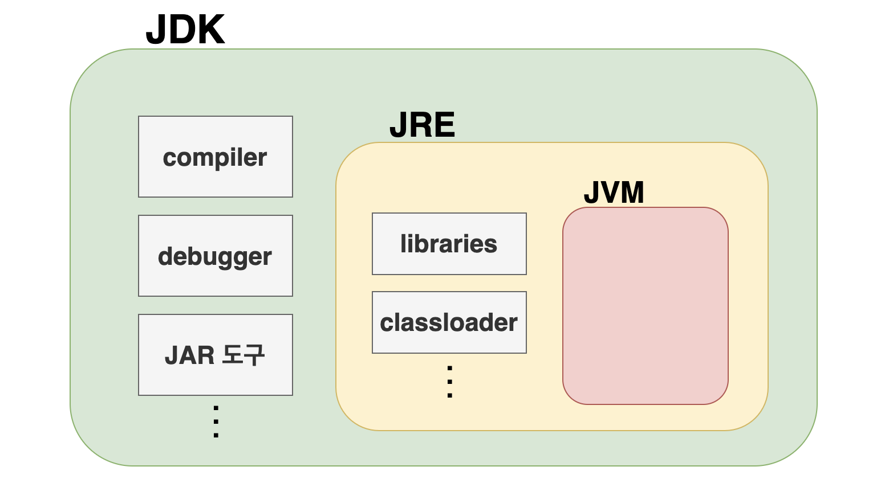
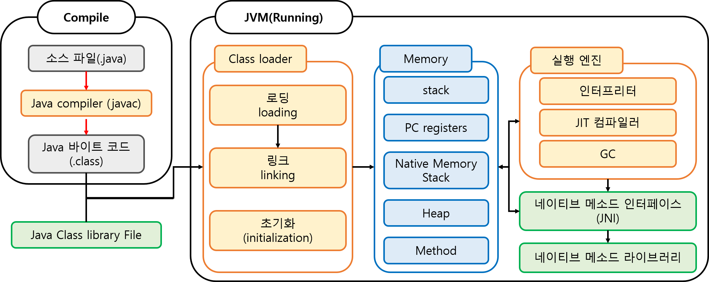

#### 날짜: 2024-05-16

 

### 🌤️ 스크럼

- 학습 목표 1 : 자바 기초 개념 공부

 

### ⚡️ 새로 배운 내용

#### 1. JAVA의 개발 환경

- **JDK(Java Development Kit)**  
  자바 개발을 위해 필요한 모든 것을 가지고 있는 소프트웨어 환경

  - `javac` 컴파일러에 의해 자바 코드(.java)를 바이트 코드(.class)로 변환한다.

- **JRE(Java Runtime Environment)**  
  JDK 내부에 존재하는, 자바 코드를 컴파일하고 실행하기 위한 환경

  - 바이트 코드를 실행하는 데 필요한 JVM을 포함한다.
  - `java` 명령어로 JVM을 실행한다.

- **JVM(Java Virtual Machine)**  
  컴파일된 자바 코드(바이트 코드)를 읽고 메모리에 저장하고 실행하는 런타임 환경
  - 바이트 코드를 실행하는 데 필요한 메모리를 관리한다.
  - OS에 종속적이지 않다. (`WORA`, Write Once, Run Anywhere)  
    OS에 따라 JVM만 설치하면 자바 프로그램을 실행할 수 있다.

#### 2. JAVA의 동장 방식

- **1\) 컴파일 (Compile)**  
  자바 소스 코드(.java)를 컴파일러(javac)로 컴파일하여 바이트 코드(.class)로 변환한다.

- **2\) 런타임 (Runtime)**  
  JVM이 바이트 코드를 읽고 실행한다.

  - **Class Loader**  
    컴파일된 바이트 코드를 가져와서 Runtime Data Area에 저장한다.
    - `로딩` : .class 파일을 읽어들여 메모리에 로드
    - `링크` : 로딩된 .class 파일을 검증, 준비, 해석하여 실행 가능한 형태로 변환
    - `초기화` : 클래스 변수(static 변수)와 static 블록을 실행
      - static : 바로 실행해도 문제 없는
  - **Runtime Data Area**  
    JVM이 프로그램을 실행하기 위해 OS로부터 할당받은 메모리 공간

    - Thread

      - `Stack Area`  
        스레드마다 고유하게 존재하고, 각종 메서드, 지역변수, 매개변수 등을 관리한다.
      - `PC Register`  
        현재 수행 중인 JVM 명령의 주소를 저장한다.
        - 각 스레드가 어떤 부분(코드)을 어떤 명령(CPU)로 실행해야 할지 관리하고 기록한다.
      - `Native Method Stack`  
        자바 외부의 네이티브 코드(C, C++ 등)를 실행하는 공간

    - `Heap Area, 힙 영역`  
      new 키워드로 생성된 객체와 배열이 저장된다.

      - 모든 스레드가 공유하며, GC(Garbage Collector)가 사용되지 않는 객체를 제거하며 메모리를 관리한다.

    - `Method Area, 메서드 영역`  
      클래스 정보, 상수, static 변수 등이 저장된다.

- **Execution Engine**  
   바이트 코드를 OS에 맞게 변환하고 Runtime Data Area에 저장된 데이터를 가져와 실행한다.
  - `Interpreter`  
    바이트 코드를 한 줄씩 읽어서 기계어로 변환하고 실행한다.
  - `JIT(Just-In-Time) Compiler`  
    실행 중인 애플리케이션의 반복적으로 실행되는 코드를 감지하여, 그 부분만 기계어로 미리 컴파일한다.
  - `GC(Garbage Collector)`
    힙 메모리 영역에서 사용하지 않는 메모리를 해제하여 관리한다.

 

### ~~🔥 오늘의 도전 과제와 해결 방법~~

 

### 🤔 오늘의 회고

- 스크럼 중 완료한 작업: `자바 기초 개념 공부`
- 기초 개념을 다시 한 번 정리하면서, 자바의 개발 환경과 동작 방식에 대해 이해할 수 있었다.

 

### 참고 자료 및 링크

- [자바 동작 순서](https://yeh35.github.io/blog.github.io/documents/java/java-comfile/)
