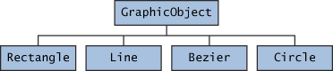
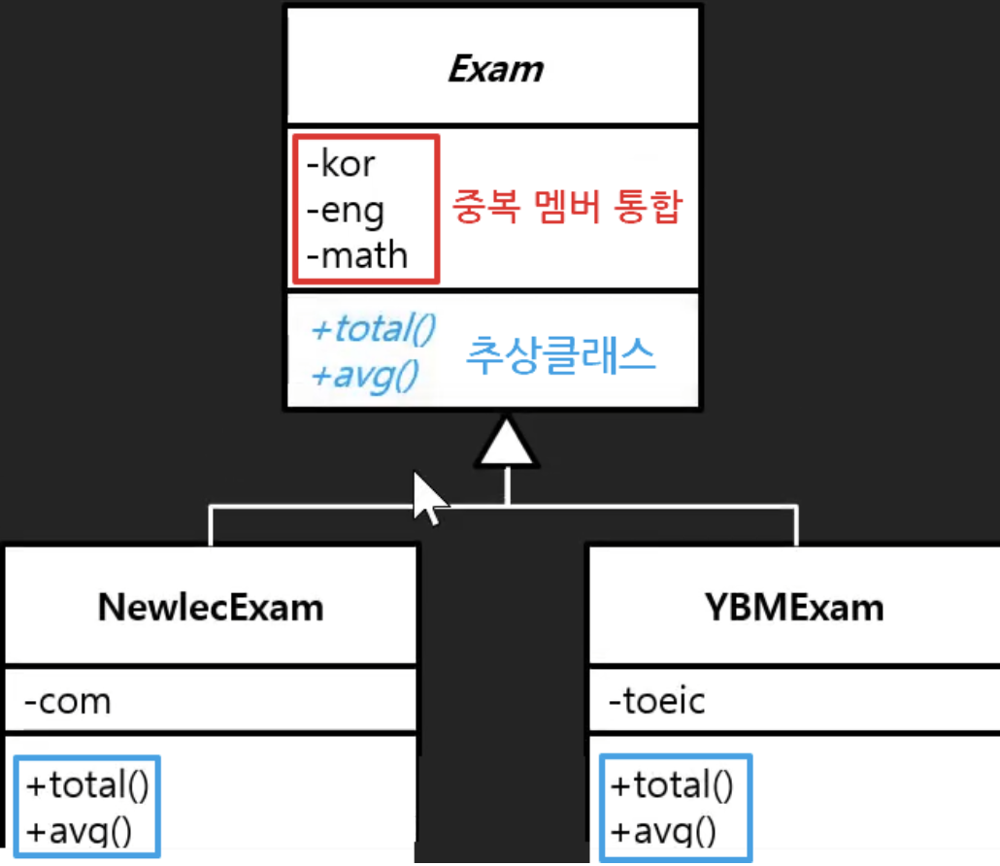

#### 날짜: 2024-05-29

<br/>

### 🌤️ 스크럼

- 학습 목표 1 : 추상 클래스 이해하기

<br/>

### ⚡️ 새로 배운 내용

> 추상이란, 실체 간에 공통되는 특성을 추출한 것

#### [JAVA] 추상 클래스 (Abstract Class)

실체 클래스(객체를 직접 생성할 수 있는 클래스)들의 공통적인 특성을 추출해서 선언한 클래스

> 추상 클래스와 실체 클래스는 상속의 관계를 가지고 있다.
>
> - 추상 클래스: 부모
> - 실체 클래스: 자식
>
> 

- 개념

  - 추상 클래스는 실체 클래스의 공통되는 필드와 메소드를 추출해서 만들었기 때문에 **객체를 직접 생성해서 사용할 수 없다.**

    ```java
    GraphicObject graphicObject = new GraphicObject(); // 에러 발생
    ```

  - 새로운 실체 클래스를 만들기 위해 부모 클래스로만 사용된다.

    ```java
    class Circle extends GraphicObject { ... }
    ```

- 용도

  - 실체 클래스의 공통된 필드와 메소드의 **이름을 통일** 할 목적  
    예를 들어 소유자의 이름을 저장하는 필드를 Telephone에서는 owner라고 하고, SmartPhone에서는 user라고 할 수 있다.  
    동일한 데이터와 기능임에도 불구하고 이름이 다르다보니, 객체마다 사용 방법이 달라진다.
  - 실체 클래스를 작성할 때 **시간을 절약**  
    공통적인 필드와 메소드는 추상 클래스인 Phone에 모두 선언해두고, 실체 클래스마다 다른 점만 선언하면 된다.

- 선언

  - `abstract` 키워드를 사용해서 선언한다.
    `Phone.java`

    ```java
    abstract class Phone {
      // 필드
      String owner;

      // 생성자
      Phone(String owner) {
        this.owner = owner;
      }

      // 메소드
      void turnOn() { ... }
      void turnOff() { ... }
    }
    ```

    `SmartPhone.java`

    ```java
    class SmartPhone extends Phone {
      // 생성자
      SmartPhone(String owner) {
        super(owner);
      }

      // 메소드
      void internetSearch() { ... }
    }
    ```

    `PhoneExample.java`

    ```java
    public class PhoneExample {
      public static void main(String[] args) {
        SmartPhone smartPhone = new SmartPhone("홍길동");

        smartPhone.turnOn(); // Phone의 메소드
        smartPhone.internetSearch();
        smartPhone.turnOff(); // Phone의 메소드
      }
    }
    ```

- 추상 메소드

  - 메소드의 선언만 통일화하고, 실제 내용은 실체 클래스마다 다르게 구현해야 하는 경우
  - 그렇다고 해서 추상 메소드를 사용하지 않고, 실체 클래스마다 메소드를 선언하면, 실수로 메소드를 빼먹을 수 있다.
  - 추상 메소드는 선언만 되어 있고, 실제 내용은 없다.
  - 추상 메소드를 가진 클래스는 추상 클래스로 선언해야 한다.
  - 추상 메소드를 가진 클래스를 상속받은 실체 클래스는 반드시 추상 메소드를 재정의(오버라이딩)해야 한다. 그렇지 않으면 컴파일 에러가 발생한다.

    `Animal.java`

    ```java
    public abstract class Animal {
      public String kind;

      public void breathe() {
        System.out.println("숨을 쉽니다.");
      }

      public abstract void sound(); // 추상 메소드
    }
    ```

    `Dog.java`

    ```java
    public class Dog extends Animal {
      public Dog() {
        this.kind = "포유류";
      }

      @Override
      public void sound() {
        System.out.println("멍멍");
      }
    }
    ```

    `Cat.java`

    ```java
    public class Cat extends Animal {
      public Cat() {
        this.kind = "포유류";
      }

      @Override
      public void sound() {
        System.out.println("야옹");
      }
    }
    ```

    `AnimalExample.java`

    ```java
    public class AnimalExample {
      public static void main(String[] args) {
        // ==== 1. 객체 생성 ====
        Dog dog = new Dog();
        Cat cat = new Cat();
        dog.sound();
        cat.sound();

        // ==== 2. Animal 변수로 타입 변환 ====
        Animal animal = null;
        animal = new Dog(); // 자동 타입 변환
        animal.sound(); // 재정의된 메소드 호출
        animal = new Cat();
        animal.sound();

        // ==== 3. (다형성을 이용) 부모 타입의 매개 변수에 자식 객체 대입 ====
        animalSound(new Dog());
        animalSound(new Cat());
      }

      public static void animalSound(Animal animal) { // 자동 타입 변환
        animal.sound(); // 재정의된 메소드 호출
      }
    }
    ```

    - `#2`에서, 자식 타입은 부모 타입으로 자동 타입 변환이 될 수 있고, 메소드가 재정의되어 있을 경우 재정의된 자식 메소드가 호출되는 상속의 특징이 그대로 적용된다.

#### 💡 추상 클래스와 인터페이스의 차이

| 구분        | 추상 클래스                                                | 인터페이스                                                     |
| ----------- | ---------------------------------------------------------- | -------------------------------------------------------------- |
| 선언        | `abstract` 키워드 사용                                     | `interface` 키워드 사용                                        |
| 필드        | 일반 필드, 상수 필드, 정적 필드 모두 선언 가능             | 상수 필드만 선언 (static final) 가능                           |
| 접근 제어자 | public, protected, default, private 모두 사용 가능         | public만 사용 가능                                             |
| 메소드      | 일반 메소드, 추상 메소드 모두 선언 가능                    | abstract method, default method, static method, private method |
| 상속 키워드 | `extends` 키워드 사용                                      | `implements` 키워드 사용                                       |
| 다중 상속   | 단일 상속만 가능                                           | 다중 상속 가능                                                 |
| 목적        | 추상 클래스를 상속 받아서 기능을 이용하고, 확장시키는 용도 | 함수의 껍데기만 있고, 함수의 구현을 강제하는 용도              |

- **추상클래스를 사용하는 경우**

  - 상속받을 클래스들이 공통으로 가지는 메소드와 필드가 많아 **중복 멤버 통합** 을 할 때
  - 멤버에 public 이외의 접근자(protected, private) 선언이 필요한 경우
  - 각 인스턴스에서 상태 변경을 위한 메소드가 필요한 경우 (non-static, non-final 필드 선언이 필요한 경우)
  - 요구사항과 함께 구현 세부 정보의 일부 기능만 지정하는 경우
  - _상수밖에 정의 못하는 인터페이스에서는 중복 멤버 통합이 불가능하다._

  <br/>

  - 예시

    

    - 멤버 필드를 상속(`extends`)을 통해 상위 클래스로 묶고, 메서드도 통합하며 추상화를 해주면서 나중에 다른 종류의 Exam 클래스를 추가/확장 하는데 있어 유연한 구조적인 객체 지향 설계를 만들 수 있게 된다.

    

- **인터페이스를 사용하는 경우**

  - 애플리케이션의 기능을 정의해야 하지만 그 구현 방식이나 대상에 대해 추상화할 때
  - 서로 관련성이 없는 클래스들을 묶어주고 싶을 때 (형제 관계)
  - 다중 상속을 지원해야 할 때
  - 특정 데이터 타입의 행동을 명시하고 싶은데, 어디서 그 행동이 구현되는지는 신경쓰지 않는 경우
  - 클래스와 별도로 구현 객체가 같은 동작을 한다는 것을 보장하기 위해 사용

      <br/>

  - 예시

      

    - 인터페이스가 없다면, 수영 동작을 하는 `swimming()` 메소드를 각 자식 클래스에 추가해야 한다. 이 때 나중에 확장을 위해 추상화 원칙을 따라야 한다고 한다면, 부모나 조상 클래스에 추상 메소드를 추가해야 하는데, 수영은 고래(`whale`)와 사람(`people`)만 할 수 있으니, 이를 동시에 포함하는 `Creature` 추상 클래스에서 추상 메소드를 추가해야 한다.

    - 하지만 `Creature` 추상 클래스에 추상 메소드를 추가하면, 곧 이를 상속하는 모든 자손/자식 클래스에서 이를 구현해야 한다. 실제로 수영을 못하는 호랑이(`tiger`)와 앵무새(`parrot`) 클래스에서도 메소드를 구현해야 하는 강제성이 생기게 된다.

    - 물론 메소드를 선언하기만 하고 빈칸으로 놔두면 되기는 하지만, 이는 객체 지향 설계에 위반될 뿐만 아니라 나중에 유지보수 면에서도 마이너스적인 효과가 된다.

- 추상클래스는 클라이언트에서 자료형을 사용하기 전에 미리 논리적인 클래스 상속 구조를 만들어 놓고 사용이 결정되는 느낌이라면, 인터페이스는 반대로 먼저든 나중이든 그때 그때 필요에 따라 구현해서 자유롭게 붙였다 땟다하는 느낌으로 보면 된다.

<br/>

### ~~🔥 오늘의 도전 과제와 해결 방법~~

<br/>

### 🤔 오늘의 회고

- 스크럼 중 완료한 작업: `추상 클래스 이해하기`
- 추상 클래스와 추상 메소드의 개념을 익혔다. 사실 추상 클래스와 인터페이스의 차이점은 아직 체감이 잘 안된다. 스레드에 대해서도 코드를 통해 더 잘 이해한 것처럼, 추상 클래스와 인터페이스에 대해서도 코드를 작성하면서 더 잘 이해할 수 있을 것 같다.

<br/>

### 참고 자료 및 링크

- [이것이 자바다] 7.8 추상 클래스
- [추상클래스 vs 인터페이스](https://inpa.tistory.com/entry/JAVA-%E2%98%95-%EC%9D%B8%ED%84%B0%ED%8E%98%EC%9D%B4%EC%8A%A4-vs-%EC%B6%94%EC%83%81%ED%81%B4%EB%9E%98%EC%8A%A4-%EC%B0%A8%EC%9D%B4%EC%A0%90-%EC%99%84%EB%B2%BD-%EC%9D%B4%ED%95%B4%ED%95%98%EA%B8%B0)
